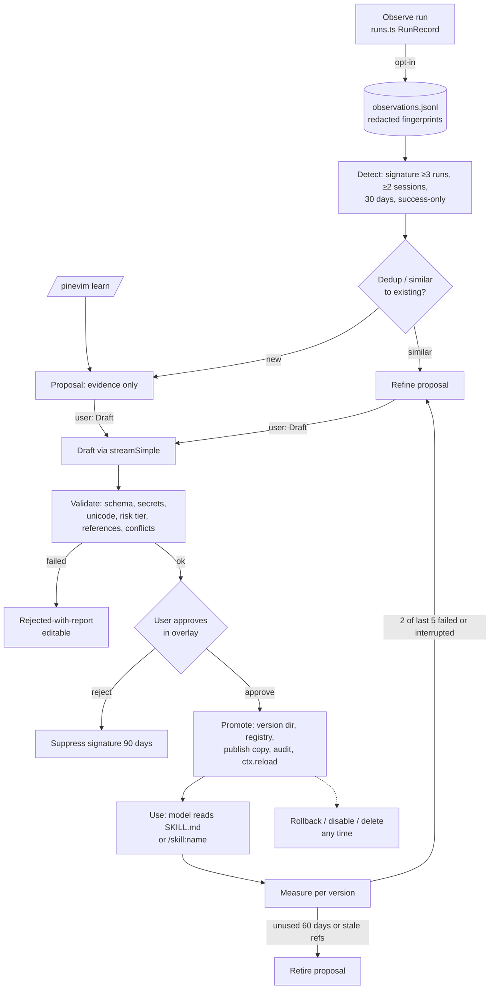

# PineVim Production UI/UX and Self-Improving Harness: Implementation Plan

Status: planning document. No implementation. Written 2026-09-23 against branch `chore/UI-Improvements` at `2b3be1a`, with uncommitted edits in `README.md`, `src/piui/index.ts`, `src/piui/components/header.ts`, and `tests/unit/piui.test.ts`.

Companion to `.agents/pinevim-ui-ux-redesign-plan.md` (the "v1 redesign plan"). This document supersedes that plan's roadmap (§17–§24). Its principles and visual vocabulary are kept where §3 below says so.

Evidence labels used throughout:

- **[fact]** is verified in this repository or in pinned `node_modules/@earendil-works/pi-coding-agent@0.87.1` (docs, `.d.ts`, examples).
- **[defect]** is a fact that is also a bug or contract violation.
- **[proposed]** is a recommendation. Proposed new paths are marked *(new)*.
- **[verify]** is a behavior that must be confirmed by a spike or test before the dependent task starts.
- **[ext]** is an external product pattern from public documentation, cited in §20.

---

## 1. Executive Summary

**Current state.** PineVim is a Node/TypeScript CLI. It runs stock Pi 0.87.1 and the user's Neovim in a private tmux server. A serialized controller (`src/core/controller.ts`) owns the workspace, and the bundled Pi extension (`src/adapters/pi/extension.ts`) is the only code that runs inside Pi. [fact] A first redesign pass already shipped:

- a lifecycle reducer, glyph and chip vocabulary, header with pine logo, status deck, and chip band (`src/piui/`)
- six themes
- turn-summary entries
- slash completions
- a styled tmux status line, popups, and menu (`src/adapters/tmux/{statusline,panels,styled}.ts`)
- an additive `telemetry` protocol field

Some of that pass is incorrect at runtime rather than unfinished. Examples:

- The styled status line is flattened to `?` characters by `literal()` before reaching tmux.
- `F12 m` sends an intent the protocol rejects.
- tmux never learns mid-run lifecycle.
- Tool cards exist as unwired code.
- The in-pane header does not update when the view changes through the prefix.

See §2.4.

**Target state.** PineVim is a *workspace that remembers*. The workspace keeps Pi's conversation engine and Neovim untouched, organizes agent work into **runs** (one request through settle), shows each fact in exactly one home, stays operable when Pi dies, and turns repeated, verified workflows into **reviewed, versioned, reversible skills** that Pi loads through its native Agent Skills mechanism.

**Architectural direction.**

1. **Fix the truth layer first.** Make the shipped surfaces render what they claim.
2. **Introduce one run and lifecycle model** in the extension. The deck, band, ledger, tmux line, and skill observer all read it.
3. **Consolidate the design system** (roles, chips, tmux palette) before adding surfaces.
4. **Keep skills extension-side.** Skills are pure logic in `src/skills/` *(new)*. They are published to Pi through the `resources_discover` → `skillPaths` hook [fact: `ResourcesDiscoverResult.skillPaths` in `dist/core/extensions/types.d.ts`] and never through repository `.agents/skills` or `.pi/skills`, which would trigger Pi project trust and pollute the repo.

**UX direction.** Three planes with strict responsibilities:

- the **Conversation** (Pi content, PineVim run grammar)
- the **Frame** (header = identity, band = now, deck = environment)
- the **Control plane** (tmux line and popups, works when Pi is dead)

Attention escalates only for three things: *needs you*, *failed*, and *a skill proposal is ready*.

**Self-improvement direction.** The system is proposed, never imposed.

- v1 learns from **explicit capture** (`/pinevim learn`) plus **opt-in, locally stored, redacted run fingerprints** that suggest candidates.
- Every candidate passes deterministic validation (schema, secrets, risk tier, references, conflicts) and **human approval**.
- Skills are versioned with hashes, measured on use, and can be refined, rolled back, disabled, or deleted from a `/pinevim skills` overlay.
- There is no silent self-modification and no auto-promotion in v1.

---

## 2. Repository Findings

### 2.1 Structure and ownership [fact]

| Area | Files | Role |
|---|---|---|
| CLI and bootstrap | `src/cli.ts`, `src/config.ts`, `src/persistence.ts`, `src/process.ts`, `src/editor.ts`, `src/diagnostics.ts` | Platform, geometry, and config validation. Workspace lock. Private state under `${XDG_STATE_HOME}/pinevim/<sha256(workspace)[0:24]>/state.json` via `Store`, `privateDirectory`, `atomicWrite`, `privateRead` (0700/0600, no symlinks, 64 KiB read cap). Opt-in allowlisted `Logger`. |
| Controller | `src/core/controller.ts` (879 lines), `src/core/state.ts`, `src/core/layout.ts` | Serialized queue (`enqueue`, `MAX_QUEUE` 64, `OP_MS` 10 s). `dispatch(intent)`, `reconcile`, `apply`, `renderStatus`, `showPanel`, `showMenu`, `quit`, `retry`, `finish`. State reducer `transition` / `reconcileChildren`. Modes `CHAT_ONLY` / `IDE_WITH_AGENT` / `IDE_FOCUS`. A 2 s reconcile heartbeat (`setInterval` in `start`). |
| Control IPC | `src/control/protocol.ts`, `server.ts`, `client.ts`, `helper.ts` | Newline JSON with 16 KiB records and per-type payload whitelists. `telemetry` is a 64-char `[a-z|0-9-]` string. `Peer` is request/ack/result with epochs and generations. The helper is a one-shot tmux `run-shell` client. |
| tmux adapter | `src/adapters/tmux/client.ts`, `config.ts`, `events.ts`, `statusline.ts`, `panels.ts`, `styled.ts` | Private server config (`tmuxConfig`). Prefix bindings including `s` / `m` / `?`. Hooks go through `Coalescer`. `status()`, `notify()`, `popup()`, `menu()`, `confirm()`. |
| Pi adapter | `src/adapters/pi/extension.ts`, `adapter.ts`, `compatibility.ts` | Extension entry. Bridge reconnect with backoff. `/ide` and `/pinevim` commands via `parseCommand`. `installUi` gates. `commandOwnership`. `SUPPORTED_PI = "0.87.1"`. |
| In-pane UI | `src/piui/index.ts` (`PiUi`), `lifecycle.ts`, `glyphs.ts`, `chips.ts`, `theme.ts`, `logo.ts`, `completions.ts`, `components/{header,deck,band}.ts`, `renderers/{turnSummary,cards,markdown}.ts`, `themes/*.json` (6) | Frame installed in `setImmediate` after `session_start`. Header via `setHeader`, deck via `setFooter`, band via `setWidget("pinevim", …, aboveEditor)`, working indicator, entry renderer `pinevim.turn_summary`. |
| Tests | `tests/unit/{core,piui,statusline}.test.ts`, `tests/integration/{lifecycle,pi,security,stress}.test.ts`, `tests/integration/harness.ts`, `tests/fixtures/provider.ts` (scripted `pine-fixture` provider with event recording), `tests/terminal/transport.py`, `scripts/{phase0.py,user-config-smoke.py,package-smoke.mjs,benchmark.mjs}` | `node:test`, compiled to `build/`. Integration uses fabricated HOME/XDG/`PI_CODING_AGENT_DIR` and private sockets. |
| Docs and conventions | `README.md`, `Docs/{Testing,Compatibility,Implementation-Evidence,PineVim-Agent-Harness-Implementation-Plan}.md`, `.github/copilot-instructions.md`, `.agents/` (this plan and the v1 plan only) | `.github/` has no CI workflow. |

### 2.2 Relevant Pi 0.87.1 capabilities [fact]

- **Skills.** Pi implements the Agent Skills spec (`docs/skills.md`). A skill is a directory with `SKILL.md`, `name` (lowercase, hyphens, 64 chars or fewer) and `description` (1024 chars or fewer). Only name and description enter the system prompt. The body loads when the model reads it, or on `/skill:name`. `disable-model-invocation` exists. Discovery sources:
  - `~/.pi/agent/skills`
  - `~/.agents/skills`
  - project `.pi/skills` and `.agents/skills` (these **require project trust**)
  - extension-provided `skillPaths` from `resources_discover`

  `/reload` re-scans.
- **Events and boundaries.**
  - `tool_call` can mutate input or block.
  - `tool_result` handlers compose.
  - `turn_end` and `agent_before_settle` are *actionable boundaries*: they may return `entries` and request one continuation.
  - `agent_settled` is final.
  - `ui_prompt_start` / `ui_prompt_end` carry `kind` ∈ `select|confirm|input|editor|custom`.
  - `message_update` carries `assistantMessageEvent`.
  - `session_compact_failed` exists.
  - `input` events see raw user text, including `/skill:` invocations.
- **Tool presentation.** `examples/extensions/built-in-tool-renderer.ts` re-registers built-ins by name, delegates `execute()` to `createReadTool(cwd)` and similar functions, and supplies `renderCall`, `renderResult`, and `renderShell: "self"`. Definition factories (`create*ToolDefinition`) are exported.
- **Nested model calls.** `ctx.modelRegistry.streamSimple()` is provider-neutral and uses the user's configured Pi model and auth. PineVim never reads credentials.
- **UI.** `ctx.ui.custom()` overlays, `ctx.ui.editor()` dialog, `select`, `confirm`, `notify`, `setStatus`, `registerShortcut`.
- **No per-tool approval system.** "Pi … does not ask for approval before every tool call" (`docs/security.md`). The only built-in *waiting* is extension UI prompts and project trust.

### 2.3 Health snapshot [fact]

- `tsc --noEmit` (src and tests) passes. `eslint src tests --max-warnings 0` passes.
- **`prettier --check` fails** on `src/adapters/pi/compatibility.ts`, `src/adapters/pi/extension.ts`, and `src/piui/renderers/cards.ts`. This breaks the documented `npm run format:check` gate.
- There is no CI, so gates are enforced only by hand.
- A stale full copy of the repo lives in `.kilo/worktrees/seasoned-quilt/`, an untracked tool worktree. Exclude it from searches and tooling.

### 2.4 Defects and debt in shipped UI work

| ID | Finding | Evidence | Impact |
|---|---|---|---|
| D1 | **Styled tmux status line is destroyed at the write boundary.** `renderStatus()` builds SGR and Unicode with `statusOptionValue`, then `Tmux.status()` passes it through `literal(message, 500)`. `plain()` maps ESC and every codepoint outside 32–126 to `?`. tmux status formats also style through `#[fg=…]`, not raw SGR. | `src/core/controller.ts` `renderStatus`, `src/adapters/tmux/client.ts:288`, `src/diagnostics.ts:19` | The control-plane strip shows `?[38;2;…m` noise or `?` glyphs. Unit tests check `statusLine()` output only, never the write path. |
| D2 | **`F12 m` menu is unreachable and malformed.** The helper sends intent `menu`, but `intents` in `src/core/state.ts` lacks `menu`, so `parseRecord` rejects it. `Tmux.menu()` also builds `display-menu -t "" name value` with no command per item. | `state.ts:5`, `protocol.ts` intent check, `client.ts:344` | A documented binding silently fails. |
| D3 | **Popups are fragile.** Payload `.slice(0, 900)` truncates SGR-heavy help (12 rows × ~70 bytes + rules). `printf '%b'` interprets backslashes in dynamic values. `read -n 1` is not POSIX: on dash, the popup exits immediately. | `client.ts:323` | Help can be truncated. On Linux the popup can flash and close. |
| D4 | **tmux never sees mid-run lifecycle.** `report()` fires only on `agent_start`, `model_select`, `session_info_changed`, and `agent_settled`. | `extension.ts:272–278` | `needs you`, `tooling`, and `compacting` never reach the tmux line or status popup. The surfaces disagree. |
| D5 | **Lifecycle reducer edge errors.** Details below this table. | `src/piui/lifecycle.ts`, `src/piui/index.ts:309` | Wrong or stuck state labels. |
| D6 | **Turn summary granularity is wrong for users.** One rule line per Pi turn (per model request), and `turn N` is Pi's internal index. | `index.ts` `turn_end` handler | A 15-step run prints 15 rule lines. That is noise, not an anchor. |
| D7 | **Information duplication and lost emphasis.** Details below this table. | `components/{header,deck,band}.ts`, `chips.ts` `chipLine` | Clutter, no error emphasis, and drift risk. |
| D8 | **Queue chip is fake.** `hasPendingMessages() ? 1 : 0`. | `index.ts` `bandInfo` | "1 queued" when 3 are queued. |
| D9 | **Theme identity is inconsistent.** Details below this table. | `extension.ts:243`, `index.ts:204`, `theme.ts`, `styled.ts` | Brand is invisible by default. The tmux palette breaks in 16/256-colour terminals. |
| D10 | **Tool cards are unwired.** `cards.ts` states that overriding built-ins "would sever Pi's … invariants". Pi's own `built-in-tool-renderer.ts` example shows the supported delegation pattern. Parity (session-level tool options, spawn hooks, mutation queue) is unproven either way. | `src/piui/renderers/cards.ts` header comment | The v1 plan's largest transcript change is absent, based on an unverified premise. |
| D11 | **Dead or duplicate code.** Details below this table. | the named files | Maintenance drag and misleading contracts. |
| D12 | **Status popup lifecycle row uses `busy`, not telemetry.** | `panels.ts` `statusPanelLines` | Disagrees with the status line. |
| D13 | **In-pane header mode goes stale.** Mode comes from `PINEVIM_IDE` at spawn plus slash-command success only. Prefix `i`/`c`/`a` and `reconcileChildren` changes never reach the extension, because there is no controller→bridge push except `shutdown`. | `index.ts` `mode`, `extension.ts` `setMode` calls | The header says CHAT while IDE is showing. |
| D14 | **Bridge connection recycles after 1024 requests.** `Peer.receive` closes when `seen.size >= 1024`, and `seen` is never pruned. | `protocol.ts:297–303` | Long sessions cause a "bridge down" blip. D4's fix (more reports) makes it frequent. **Must be fixed before D4.** |
| D15 | **Old-plan permission UX has no backend.** The `? bash rm -rf … waiting for approval` card assumes a Pi approval flow that does not exist. | `docs/security.md` | Any UI promising approvals would lie unless PineVim adds a `tool_call` gate. |

**D5 details.**

- `promptEnd` always returns `tooling`, even for prompts raised while idle or streaming.
- `session_compact` forces `streaming`, even for idle or manual compaction.
- `session_compact_failed` is unhandled, so the state sticks at `compacting`.
- `messageUpdate` reports `thinking` whenever *any* thinking block exists in the message, even while text is streaming. It should use `assistantMessageEvent`.
- `toolsRun` resets per Pi turn (model call), not per user run.

**D7 details.**

- Lifecycle appears in the header, the band, the deck, and the tmux line.
- ctx, model, and thinking appear in both the band and the deck.
- `chipLine` returns a joined string, and callers style the whole line `muted`, so per-chip roles (error, waiting) are discarded.
- The `ROLE` map is copied three times.

**D9 details.**

- Default `ui.theme: "auto"` applies no PineVim theme. `preferredThemeName` is tested but unused at runtime.
- The theme is applied twice: in `installUi` synchronously and in `PiUi.install` via `setImmediate`.
- `styled.ts` hard-codes a truecolor palette unrelated to the active theme.

**D11 details.**

- `assertPiApiSurface` and `probePiApiSurface` are unused. `probeHooks` in `piui/index.ts` duplicates them.
- `panelHelperActions` and `panelHelperCommand` are unused.
- The `dispatch` panel branch is unreachable.
- The `validateConfig` unknown-field message omits `ui`.
- `markdown.ts` is a note-only module.

### 2.5 Architectural constraints that shape everything

1. **PineVim does not own the agent loop.** Every agent observation comes from Pi extension events inside the Pi process. The controller only receives what the bridge reports through the 16 KiB-bounded protocol.
2. **No terminal scraping, no shell interpolation, no Neovim RPC, and no reading Pi credentials** (`.github/copilot-instructions.md`). "Open file in editor" from the agent UI is therefore out of scope.
3. **Privacy rule: logs never contain prompts, transcripts, or secrets.** Skill observation must store only redacted, structured fingerprints, and it is a new, documented, opt-in data class (§10.4).
4. **Config is strict** (`validateConfig`). Every new setting needs whitelisting, validation, README docs, and `scripts/user-config-smoke.py` coverage.
5. **Pi is pinned to 0.87.1.** Every Pi API PineVim uses must appear in a compatibility probe and a fixture test.
6. **The tmux plane must never depend on the in-pane UI** (README ownership contract).

---

## 3. Existing Redesign Plan Audit

| v1 plan area | Status | Notes and action |
|---|---|---|
| §4 principles (own frame, structure over color, lifecycle-first, progressive disclosure, calm, terminal-native, honesty) | **Keep** | Folded into §5 here with two additions: *one home per fact* and *learning is proposed*. |
| §5 direction "Canvas core, Console telemetry" | **Keep** | Still correct. |
| Protocol v1.1 telemetry | **Partial** | Implemented as a pipe string. Under-reported (D4). Replace with structured fields (§13.3). |
| API-surface compatibility assertions | **Partial** | `probeHooks` gates install. `assertPiApiSurface` is dead (D11). Unify. |
| Themes (dark, light, mono, plus neon, forest, snow) | **Partial** | Assets are complete and tested. Default does not apply (D9). The tmux palette is not theme-aware. |
| Glyphs and chips | **Done, with defect** | Roles are dropped at render (D7). |
| Lifecycle reducer (9 states) | **Partial** | Defects D5. Missing run scope. |
| tmux segmented status line | **Broken** | D1. |
| Styled toasts | **Partial** | Severity prefix words only. ASCII-only by design (fine). Keep plain. |
| Help and status popups | **Fragile** | D3, D12. |
| `F12 m` menu | **Broken** | D2. |
| Tool cards via `registerTool` | **Not done** | Primitives only (D10). Needs a parity spike (Phase 3). |
| Turn summaries | **Done, wrong unit** | D6. Replace with a run ledger. Keep the old renderer for existing sessions. |
| Markdown transformer | **Obsolete** | Correctly rejected (content mutation). Delete the module. |
| Header (logo) | **Done** | Remove the lifecycle chip (IA dedupe). Fix stale mode (D13). |
| Status deck | **Done** | Re-scope to environment facts (§7). |
| PineComposer via `CustomEditor` | **Obsolete → replaced** | `renderTopBorder` is not overridable. The band widget is the correct substitute. Keep it. |
| Slash completions | **Done** | Native `getArgumentCompletions`. Extend for new subcommands. |
| Permission `?` cards | **Obsolete as written** | D15. Re-scoped to an optional PineVim guard (deferred, §18). |
| Command palette rejected | **Keep rejected** | A single `/pinevim skills` overlay is justified separately (§11). |
| §15 responsive table | **Partial** | Implemented piecemeal. No resize-sweep test. |
| §22 testing and §23 acceptance | **Mostly outstanding** | No monochrome render pass, benchmarks, or golden renders. |

**Missing from the v1 plan entirely:**

- a run-level unit of work
- file-change awareness and review
- error taxonomy and recovery copy
- onboarding
- measurable performance budgets
- CI
- skills and learning
- observability of the UI layer itself
- data-retention policy
- backward compatibility for persisted custom entries

---

## 4. UX Problems and Opportunities

Each item states the **current behavior**, the **problem**, and the **change**.

1. **Control plane shows garbage (D1).** The tmux strip is PineVim's only surface that works when Pi is dead, and it currently fails at that job. *Change:* tmux-native `#[fg=…]` styling with a palette of terminal-named colors, a dedicated writer that sanitizes dynamic values only, and an integration test that reads back `status-left`.
2. **The same state appears in four places, three times in one pane (D7).** Users cannot tell which one is authoritative, and it costs 3 of about 30 rows. *Change:* one home per fact (§7). Header = identity. Band = now. Deck = environment.
3. **No unit of work (D6).** Users think in requests. Pi turns are model calls. *Change:* **runs** from `agent_start` to `agent_settled`. One **run ledger** entry per run with duration, tools, failures, files changed, skill used, and outcome.
4. **Surfaces disagree mid-run (D4, D12, D13).** tmux says idle while Pi waits for input. The header says CHAT in IDE view. *Change:* telemetry v2 pushed on lifecycle change (coalesced), controller→bridge `view` push, and the status popup built from the same telemetry.
5. **Tool activity is Pi's generic box stream (D10).** A 30-tool run cannot be scanned. *Change:* the parity spike, then one-line tool cards with state glyphs. If parity fails, fall back to a ledger-only summary. Either way the run ledger delivers scanability.
6. **Changes are invisible as a set.** Nothing answers "what did this run change?" *Change:* the run records paths from `edit` and `write` calls plus `git diff --numstat` at settle (`pi.exec`, argv, bounded). The ledger shows `3 files +42 −7`. A `/pinevim review` overlay lists them. Opening files stays in Neovim, because there is no RPC.
7. **Errors are words in toasts.** Controller failures go to `notify(safeError)`, and Pi errors show only as a `✗ error` chip. *Change:* the error taxonomy in §9.5 maps each class to a surface, copy, and next action.
8. **Discoverability ends at `F12 ?`.** No first-run orientation. `/pinevim help` just shows the popup. *Change:* a first-run welcome entry (once per workspace) and a keys popup that includes slash commands and skill commands.
9. **Help and menu are broken (D2, D3).** *Change:* popups render through a Node viewer launched by `display-popup -E` that reads a controller-written private file, and the menu is rebuilt with proper `name key command` triples that run the helper.
10. **No learning.** Users repeat "run `npm run build && tsc -p tsconfig.test.json && node --test …`" every session. *Change:* the skill system (§10–§11).
11. **Brand is off by default (D9).** *Change:* decision in §8.1. Apply `pinevim-dark` or `pinevim-light` when `ui.theme` is `auto` **and** the user has not chosen a non-default Pi theme. Otherwise respect the user's choice.

---

## 5. PineVim Product Design Principles

1. **Own the frame, respect the engine.** PineVim dresses and instruments Pi through public hooks only. It never re-implements Pi's content, pickers, or editing.
2. **One home per fact.** Every piece of state has exactly one primary surface. Other surfaces may *mirror* it only when the primary surface is not visible (tmux line when Pi is dead, unfocused, or hidden).
3. **The run is the unit.** Progress, summaries, change sets, and learning are all expressed per run.
4. **Structure over color.** Every state reads correctly with color stripped: glyph + word + position.
5. **Honest state.** Show only what is observed. No fabricated approvals, progress percentages, or retries PineVim cannot see.
6. **Quiet by default, loud on need.** Only *needs you*, *failed*, and *proposal ready* escalate (accent or error role, notify once). Everything else is muted and static.
7. **Learning is proposed, never imposed.** PineVim may notice and suggest. Only the user promotes, and every learned change is inspectable, versioned, and reversible.

Use these as a review checklist. Every new UI element must name the principle it serves and its single home.

---

## 6. Target User Experience

**Launch.** `pinevim ~/code/api` opens the header with pine mark, workspace, session, and view. On a workspace's first launch, one **welcome entry** in the transcript lists the three planes in three lines (`type to work · F12 ? keys · /pinevim skills`). The tmux strip is readable: `api · CHAT · ● idle · F12 ?`.

**Task entry.** The band above the composer reads `● idle` with ctx, model, and thinking in the deck. With 2 learned skills active, the deck shows `skills 2`.

**Agent execution.** When the user submits, the band shows the run state and live activity: `● tools 4 · bash · 12 s`. Thinking, responding, and compacting are words, not colors. If an extension prompt blocks, the band switches to `? needs you (confirm)` in accent, and the tmux strip mirrors `? needs you`, so a user in Neovim sees it.

**Tool execution.** If the Phase 3 spike passes, each tool is one line: `✓ read src/auth.ts`, `● bash npm test  4.1 s`, `✗ edit src/x.ts  no match`. Otherwise Pi's native rendering stays and the ledger carries the summary.

**Code changes.** At settle, the run ledger closes the run:
`── run 3 · 38 s · 12 tools · 1 failed · 3 files +42 −7 · ctx 51% ──`
`/pinevim review` lists the files and diffstats for the last run.

**Review.** The user inspects diffs in Neovim (`F12 i`). PineVim never opens files remotely.

**Completion.** The band returns to `● idle`. If the run matched a known repeated pattern (opt-in observation) or the user typed `/pinevim learn`, the ledger carries a quiet `◆ skill proposal ready · /pinevim skills` marker, at most once per run.

**Future reuse.** After approval, the skill `api-test-cycle` appears in Pi's skill list (name and description only). When the model loads it, the ledger notes `◆ used api-test-cycle v2`. Its success is measured, and repeated failures produce a refine proposal. The user can roll back to v1 or disable it in two keystrokes in the overlay.

---

## 7. Target Information Architecture

```
┌ tmux client ────────────────────────────────────────────────────────────┐
│ ┌ Pi pane ─────────────────────────────┐ ┌ nvim pane (IDE views) ─────┐ │
│ │ HEADER   identity: ▲ pinevim · ws ·  │ │  Neovim owns 100%          │ │
│ │          session · VIEW              │ │                            │ │
│ │ TRANSCRIPT  Pi content               │ │                            │ │
│ │   + tool cards (gated)               │ │                            │ │
│ │   + run ledger · welcome · skill     │ │                            │ │
│ │     markers                          │ │                            │ │
│ │ BAND     now: lifecycle · activity · │ │                            │ │
│ │          elapsed · queue · attention │ │                            │ │
│ │ COMPOSER Pi editor (untouched)       │ │                            │ │
│ │ DECK     environment: ctx gauge ·    │ │                            │ │
│ │          model · think · branch ·    │ │                            │ │
│ │          skills N · F12 ?            │ │                            │ │
│ └──────────────────────────────────────┘ └────────────────────────────┘ │
│ TMUX STRIP  mirror: ws · VIEW focus · lifecycle · attention · F12 ?     │
└─────────────────────────────────────────────────────────────────────────┘
Overlays: tmux popups (keys, workspace status, menu). Work even when Pi is dead.
          Pi overlays via ctx.ui.custom: /pinevim skills, /pinevim review.
```

| Surface | Purpose | Appears | Contains | Enter / leave | Keyboard | Constrained sizes | Empty / loading / error |
|---|---|---|---|---|---|---|---|
| Header (`components/header.ts`) | Identity | Always (≥60 cols) | Mark, workspace, session name, view (CHAT/IDE/FOCUS) | n/a | none | 60–79: one line. <60: hidden. | No session name: omit segment. |
| Band (`components/band.ts`) | What is happening now | Always (≥40 cols) | Lifecycle word + glyph, current tool, run elapsed, real queue count, attention chip (`? needs you` / `◆ 1 proposal`) | n/a | none | <80: lifecycle + attention only | Idle: `● idle`. Bridge down: `▲ controller disconnected · pinevim --resume`. |
| Deck (`components/deck.ts`) | Environment (slow facts) | Always | ctx gauge, model, thinking, git branch, `skills N`, `F12 ?` | n/a | none | <60: gauge + `F12 ?` | ctx unknown: gauge hidden. |
| Transcript entries | Durable anchors | Per run / event | Run ledger, welcome (once), skill markers | Scroll (Pi) | Pi's `app.tools.expand` toggles ledger detail | Ledger drops segments tail-first | Interrupted and failed variants |
| Tool cards *(gated)* | Per-tool outcome | Per tool call | Glyph, tool, primary arg, counts, duration; expanded output tail | Pi expand toggle | Pi's | Width bands in `cards.ts` | Running, success, warn, fail, interrupted |
| tmux strip | Mirror when the pane is not in view, or Pi is dead | Always | ws, view+focus, lifecycle, attention, prefix hint | n/a | prefix keys | Tail-drop. Resize warning replaces telemetry. | Pi dead: `✗ pi exited · F12 r`. |
| Keys popup (`F12 ?`) | Discoverability | On demand | Prefix chords, slash commands, skill commands | `F12 ?` / any key | Any key closes | Min 44×16. Otherwise fall back to toast. | Popup failure: toast. |
| Status popup (`F12 s`) | Workspace truth | On demand | Panes, bridge, lifecycle (telemetry), session, versions, skills counts | `F12 s` / any key | Any key | Same | Same |
| Menu (`F12 m`) | Mouse/arrow access to intents | On demand | Same intents as chords | `F12 m` / Esc | Arrows, Enter, shortcut keys | tmux-native | Failure: toast pointing to `F12 ?`. |
| Skills overlay (`/pinevim skills`) *(new)* | Govern learned skills | On command, or from a proposal marker | Tabs: Proposals · Active · Disabled · History. Detail pane: SKILL.md, provenance, risk, validation, metrics, versions. | Command / Esc | j/k, Enter, a approve, r reject, d disable, b rollback, e edit, x delete | <80 cols: single column list → detail | Empty: "No skills yet. `/pinevim learn` after a run captures one." Loading: "validating…". Error: validation report. |
| Review overlay (`/pinevim review`) *(new)* | What the last run changed | On command | File list with `+/−`, tool that touched each, failures | Command / Esc | j/k, y copies path | Single column | Empty: "Last run changed no tracked files." Not a git repo: shows paths without diffstat. |
| Notifications (`ctx.ui.notify`, `tmux.notify`) | Transient, actionable events only | Rare | Bridge degraded, proposal ready (once per run), validation failed, controller errors | Auto-dismiss | none | n/a | n/a |
| Settings | Config file only | n/a | `config.json` (`ui`, new `skills`) | Edit file | n/a | n/a | Strict validation errors at launch |

**Rejected surfaces:** a general command palette (Pi autocomplete + popups suffice), a persistent side panel (terminal width is the scarce resource; Neovim owns the side), a session browser (Pi owns `/resume`, `/tree`, `/name`), and a toast stream for tool events (the ledger covers it).

---

## 8. Design System Plan

### 8.1 Foundations

- **Color roles** (unchanged vocabulary, now enforced): `accent` (brand, attention), `text`, `muted` (structure, metadata), `success`, `warning`, `error`.
  - In-pane, roles resolve through Pi `Theme.fg(role)`.
  - In tmux, roles resolve to **terminal-named colors**: `accent=green`, `success=green`, `warning=yellow`, `error=red`, `muted=brightblack`, `text=default`. Emitted as `#[fg=…]` so they respect the user's palette and 16/256-color terminals, which fixes the D9 tmux half.
- **Default theme decision [proposed]:** with `ui.theme: "auto"`, apply `preferredThemeName(undefined, detectedScheme)` **only if** Pi's active theme is one of Pi's built-in defaults. A user-selected custom theme wins. The extension applies the theme once, in `PiUi.install` only.
- **Typography and case:** lowercase labels, UPPERCASE view chips, bold only for the user's own text and overlay titles.
- **Spacing:** 1-cell unit, one blank line between runs, none inside a run.
- **Borders:** single-line in-pane. Overlays use a single-line box with a title. tmux popups use tmux's border.
- **Glyphs:** `src/piui/glyphs.ts` is the only table. Add `skill: "◆" / "*"` and `file: "±" / "+-"`. Every glyph sits next to a word.
- **Motion:** only the working indicator (existing) and the running-tool glyph (cards). `ui.motion: "off"` makes both static.
- **Focus and selection (overlays):** selected row uses `selectedBg` plus a leading `›` (non-color cue). Disabled items are `muted` with `(disabled)` text.
- **Attention budget:** at most one accent or error chip in the band at a time. Precedence: needs you > failed > proposal.

### 8.2 Components to formalize (reuse first)

| Component | Current location | Change |
|---|---|---|
| `style(theme, role, text)` | ROLE map copied in `header.ts`, `deck.ts`, `band.ts` | Extract to `src/piui/style.ts` *(new)*. Delete the copies. |
| Chip / `chipLine` | `src/piui/chips.ts` | Return styled segments (`renderChips(theme, chips, width, sep)`) so per-chip roles survive. Keep the pure width logic for tests. |
| Lifecycle label | `lifecycle.ts` `lifecycleLabel` | Move to a presentation module that reads `RunState` (§13). Single vocabulary shared with tmux (`src/piui/vocabulary.ts` *(new)*, imported by `statusline.ts` so words match exactly). |
| Gauge | `chips.ts` `contextGauge` | Add ASCII cells (`#`/`-`) in ASCII mode (currently always `▮▯`). |
| Rule line | `renderers/turnSummary.ts` `renderTurnSummaryLine` | Generalize into `ruleLine(parts, width, g)` for the ledger, welcome, and markers. |
| Tool card | `renderers/cards.ts` | Keep the formatting functions. Wire through renderers only if the spike passes. |
| Overlay list/detail | none | `src/piui/overlays/listDetail.ts` *(new)*: one component used by both skills and review overlays (selection, scroll, empty/loading/error states). |
| tmux styled segment | `adapters/tmux/styled.ts` | Replace SGR with `#[fg=…]` role map. `visibleWidth` strips `#[...]`. `escapeTmuxFormat` stays. |
| Popup renderer | `panels.ts` + `client.popup` | Lines become plain text + `#[...]`-free ANSI for the viewer (§9.4). |

**Migration strategy.** Land `style.ts` and `renderChips` first, with golden tests of current output. Convert header, deck, and band one at a time. Each conversion changes that component's golden file intentionally. No behavior change beyond the roles now showing.

---

## 9. Agent Execution UX

### 9.1 Run lifecycle (display vocabulary)

| State | Source events [fact] | Band | tmux strip | Notes |
|---|---|---|---|---|
| `idle` | `agent_settled`, no error | `● idle` (success) | `● idle` | |
| `thinking` | `message_update` with `assistantMessageEvent.type` a thinking delta | `◦ thinking` | `● working` | [verify] exact event type names in `pi-ai` `AssistantMessageEvent` |
| `responding` | `message_update` text delta | `● responding` | `● working` | Renamed from `streaming` (user language). |
| `tooling` | `tool_execution_start` … `_end` | `● tools N · <name> · 12 s` | `● working N` | N counts per run. Parallel tools: show the count of running tools. |
| `waiting` | `ui_prompt_start` / `_end` (+kind, title) | `? needs you (confirm)` (accent) | `? needs you` (accent) | Return to the pre-prompt state on end (stack), not a hard-coded `tooling`. |
| `compacting` | `session_before_compact` → `session_compact` / `_failed` | `⌁ compacting` | `⌁ compacting` | Return to the pre-compaction state. On failure: `▲ compaction failed` note. |
| `settling` | `agent_end` → `agent_settled` | `● finishing` | `● working` | |
| `failed` | Final assistant `stopReason === "error"` at settle | `✗ failed · see run` (error) | `✗ failed` | Renamed from `error`. Clears on next `agent_start`. |
| `interrupted` | `ctx.signal` abort / `stopReason "aborted"` | `■ stopped` (warning) | `■ stopped` | |

**No `retrying` state.** Pi's automatic retry is not observable through events [fact: no retry event in the type list]. Showing one would violate principle 5. Pi's own working-status text still displays retries.

**No `awaiting_permission` state** unless the optional guard (§18) ships. It would then appear as `waiting` with kind `guard`.

### 9.2 Progress and cancellation

- Run elapsed time updates on each lifecycle event, not on a timer. The working indicator already animates.
- Cancellation stays Pi's native interrupt. PineVim reflects it (`■ stopped`) and records `interrupted` in the ledger.

### 9.3 Results, file changes, and completion

- The **run aggregator** (`src/piui/runs.ts` *(new)*) accumulates:
  - tools by name, failures, and recoveries (a failure followed by success of the same tool family)
  - `edit` / `write` paths (relativized to cwd, bounded to 200)
  - start and end times
  - skills used
  - outcome
- At `agent_before_settle`, it returns an `entries` draft of `pinevim.run` [fact: `BoundaryResult.entries`, `CustomEntryDraft`] and runs `git diff --numstat -- <paths>` via `pi.exec` with argv, a timeout, and output capped at 16 KiB. Non-git workspaces skip the numstat. [verify] whether `pi.exec` inside `agent_before_settle` delays settle unacceptably. Budget 300 ms. On timeout, omit the numstat.
- Keep registering the `pinevim.turn_summary` renderer for old sessions. Stop writing new ones.

### 9.4 Control-plane popups (fix D3)

`display-popup -E -w W -h H "<node> <helper> view <runtime> <kind>"`. The helper's new `view` action:

1. reads `<runtime>/panel-<kind>.txt`, which the controller writes with `atomicWrite`-style 0600 in the private runtime dir
2. prints it
3. waits for one key in raw mode on stdin
4. exits

The helper does no network I/O and no shell. `helperCommand`'s action regex gains `view`. Content is plain text plus SGR, because the popup is a real terminal, so no 900-char limit applies. Menu items become `name key "run-shell -b <helperCommand(intent)>"` triples.

### 9.5 Error taxonomy

| Class | Example source | Surface | Copy pattern | Next action |
|---|---|---|---|---|
| Model/run failure | `stopReason: "error"` | Band `✗ failed` + ledger `failed: <short reason>` (bounded, `plain`) | "Run failed: <reason>." | Retry by re-prompting. Pi shows details inline. |
| Tool failure | `tool_execution_end.isError` | Card `✗` / ledger count | none (counts only) | Agent handles it. |
| Compaction failure | `session_compact_failed` | Ledger note `▲` | "Compaction failed; context may be near its limit." | `/compact` manually. |
| Bridge disconnected | `Peer` closed | Band (in-pane) + tmux strip | "Controller disconnected. Prefix keys still work; run `pinevim --resume` if views stop responding." | `--resume` |
| Pi exited | `reconcileChildren` | tmux strip error + toast | "Pi exited (<code>). F12 r starts a replacement with the last session." | `F12 r` |
| Controller operation | `dispatch` catch | tmux toast (`notify` error) | Existing `PineError` messages (already actionable) | As stated |
| Skill validation | `src/skills/validate.ts` | Overlay report + one notify | "Skill proposal failed validation: <first issue>." | Edit or reject |
| Skill tamper/hash mismatch | Publish check | Notify + auto-disable | "Skill <name> changed outside PineVim and was disabled." | Review in overlay |

---

## 10. Self-Improving Skill Architecture

### 10.1 Decisions

| Decision | Benefits | Costs | Alternatives | Reason |
|---|---|---|---|---|
| **Skills are Agent Skills (`SKILL.md`), published via `resources_discover.skillPaths`** | Native Pi loading and progressive disclosure. Portable. `/skill:name` works. No new runtime. | Changes need `/reload` (`ctx.reload()` from a command context) | A custom tool that injects instructions. A `before_agent_start` prompt edit. | Reuses Pi's supported mechanism. Zero prompt-engineering duplication. |
| **Storage in `${XDG_DATA_HOME}/pinevim/skills`, never in the repo** | No project-trust prompts. No accidental commits. Per-user ownership. | Not shared with the team by default | Project `.agents/skills` or `.pi/skills` | Project dirs trigger Pi trust and mix learned content with source. An explicit **export** can come later (§19). |
| **Extension-side subsystem; controller unaware except for counts** | Observations are available only in Pi. Keeps the controller small. | Skill logic runs in the Pi process | Controller-side store over IPC | 16 KiB IPC and the controller's layout mandate make it the wrong home. |
| **Instructions-only generated skills (no `scripts/`) in v1** | Nothing executable is generated. The risk surface is prose plus commands the model still runs through normal tools. | Less powerful | Generated scripts | Executable generation needs sandboxing PineVim does not have. |
| **Explicit capture first, passive observation opt-in** | Near-zero false positives. Consent is clear. | Slower learning | Hermes-style autonomous creation after complex tasks [ext] | Principle 7. The PineVim privacy rule. |
| **No auto-promotion in v1** | The user sees everything. | Friction | Auto-promote low-risk | Needs metrics to justify. Revisit with §17 data. |
| **Drafting via `ctx.modelRegistry.streamSimple()` on explicit user action** | Uses the user's model and auth through Pi. Not in the transcript. Bounded. | Token cost, shown before drafting | `sendUserMessage` (pollutes the transcript, the agent may act on it) | Keeps the conversation clean. The user confirms the cost. |

### 10.2 Skill model

On disk, per skill and version:

```
${XDG_DATA_HOME:-~/.local/share}/pinevim/skills/          (0700, privateDirectory)
  registry.json              index (atomicWrite, 0600)
  audit.jsonl                append-only, rotated at 1 MiB × 3
  store/<scopeKey>/<skillId>/v<N>/SKILL.md
  store/<scopeKey>/<skillId>/v<N>/meta.json
  proposals/<proposalId>.json
  published/<scopeKey>/<name>/SKILL.md     materialized active versions (the skillPaths roots)
${XDG_STATE_HOME}/pinevim/<workspaceKey>/observations.jsonl   opt-in, bounded (§10.4)
```

`scopeKey` is `global` or `ws-<Store.key>`, reusing the workspace hash from `src/persistence.ts`. `privateRead`'s 64 KiB cap is kept, and `SKILL.md` is capped at 16 KiB.

`meta.json` fields. Only fields with a concrete consumer are included.

| Field | Purpose (consumer) |
|---|---|
| `id` (uuid), `name`, `version` | Identity and registry. `name` is the Agent Skills name. |
| `scope` (`workspace` / `global`), `workspaceKey?` | Publish root selection. Contamination guard. |
| `sha256` | Tamper detection at publish and load (§10.9) |
| `createdAt`, `createdBy` (`capture` / `suggestion` / `refine` / `manual-edit`) | Provenance display |
| `evidence` | Up to 10 of `{ sessionId, runId, at, outcome }` plus the signature hash. Why it was learned. |
| `parentVersion` | Rollback and diff |
| `risk` (`low` / `medium` / `high`) + `findings[]` | Validation display and gating |
| `validation` (`passed` / `warnings` / `failed`) + `checkedAt` | Promotion gate. Staleness recheck. |
| `approvedAt` | Audit |
| `metrics` (`uses`, `completed`, `failed`, `interrupted`, `lastUsedAt`) | Refine and retire proposals. Overlay. |

`registry.json` holds `skills[]`: `{ id, name, scope, activeVersion | null, status: active|disabled|retired, versions: number[] }` and `proposals[]` summary. Unknown fields are rejected, following the strictness of `validateMetadata`.

`SKILL.md` frontmatter written by PineVim:

- `name` and `description` (required)
- `metadata: { pinevim-id, pinevim-version }`, so usage can be attributed and published files mapped back
- nothing executable

### 10.3 Lifecycle



### 10.4 Observation (opt-in) and the privacy contract

- Default `skills.observe: "off"`. On the first `/pinevim learn` or `/pinevim skills` use, ask once through `ctx.ui.select`: "Let PineVim keep redacted command and tool patterns for this workspace to suggest skills?" Store the answer in the registry.
- Per settled run, append one bounded record (≤2 KiB) containing:
  - `runId`, `sessionId`, `at`, `outcome`, `durationMs`
  - `steps[]`, up to 40 normalized fingerprints, each `{ tool, key }`:
    - `bash`: argv0 + first non-flag subcommand, e.g. `npm test`, `git status`, `node --test`. Values of `--flag=value`, env assignments, URLs, quoted strings, and anything matching the secret patterns are dropped.
    - `read`/`edit`/`write`: workspace-relative directory + extension, e.g. `src/core/*.ts`. Paths outside the workspace become `<outside>`.
    - Other tools: the name only.
  - `failures` / `recoveries` counts, `skillsUsed[]`, `filesChanged` count
- **Never stored:** prompt text, assistant text, tool output, full commands, absolute paths, or environment values.
- Retention: 500 records or 60 days per workspace, whichever comes first. Pruned on write.
- `/pinevim skills` → History → "Clear observations" deletes the file.
- `observations.jsonl` lives under the workspace state dir, so the existing 0700 guarantees apply. Document it in README and `Docs/Compatibility.md` as a new data class.

### 10.5 Detection (`src/skills/detect.ts`)

- **Signature:** the longest contiguous step subsequence of length ≥3, compressing consecutive duplicates, that appears in successful runs. Use n-gram counting over normalized keys.
- **Minimum evidence:**
  - ≥3 successful runs
  - across ≥2 sessions
  - within 30 days
  - at least one step that is not `read` or `ls`, so pure browsing is never learned
- **Excluded:** runs with `interrupted`, runs whose outcome is `failed`, and runs that consist only of one tool.
- **Dedup:** the signature hash equals an existing proposal or skill evidence hash, so drop it.
- **Similarity:** Jaccard over step key sets ≥0.6 against an active skill's evidence produces a *refine* proposal instead of a new one.
- **Rate limits:**
  - ≤1 suggestion notify per session
  - ≤5 open proposals per workspace
  - proposals expire after 14 days
  - rejected signatures are suppressed for 90 days
  - detection runs at `agent_settled`, off the hot path (`setImmediate`) with a 50 ms budget over ≤500 records
- **Conflict detection:** the name collides with `pi.getCommands()` entries whose source is a skill, or with another PineVim skill, so the draft must rename.

### 10.6 Drafting (`src/skills/draft.ts`)

- Input:
  - the evidence fingerprints
  - for explicit `/pinevim learn`, the **current session branch** (`ctx.sessionManager.getBranch()`) trimmed to the last run's user message, tool calls (names + args), and final assistant text, capped at 24 KiB
  - the workspace's `package.json` script names, if present
- The system prompt instructs the model to produce only `SKILL.md`: frontmatter `name`/`description`, then steps. Constraints: no secrets, no network or destructive commands unless evidenced, relative paths only, and "when to use / when not to use" sections.
- The model is `ctx.model` unless `skills.draftModel` is configured [proposed, optional]. Show "Draft with <model> (~N tokens)?" first.
- Output parsing: extract the first fenced or whole-document frontmatter block. Reject anything else.
- Transcript text is untrusted input. That is why validation and human review are mandatory.

### 10.7 Validation (`src/skills/validate.ts`) — deterministic, no execution

1. **Schema:**
   - Agent Skills name regex and length
   - description 20–1024 chars and not generic (reject "helps with …" style descriptions under 8 words)
   - body ≤16 KiB
   - UTF-8
2. **Unicode safety:** reject control chars, bidi overrides (U+202A–202E, U+2066–2069), and zero-width chars (U+200B–200D, U+FEFF). Covers smuggling.
3. **Secrets (hard reject):**
   - known key prefixes (`sk-`, `ghp_`, `github_pat_`, `AKIA`, `xox[abp]-`, `-----BEGIN`)
   - high-entropy tokens of ≥32 chars
   - reuse the canary style from `tests/fixtures/provider.ts` for tests
4. **Risk tier** from command and prose scan:
   - **high:** network egress (`curl`, `wget`, `nc`, `scp`, `ssh`, `git push`), destructive commands (`rm -r`, `git reset --hard`, `git clean`, `--force`), privilege (`sudo`, `chmod 777`), credential paths (`~/.ssh`, `.env`, `auth.json`, `~/.pi/agent`), instructions to hide actions or ignore the user ("do not tell", "ignore previous"), or absolute paths outside the workspace
   - **medium:** local command execution
   - **low:** read-only guidance
   - High risk requires typed confirmation and is never allowed at `global` scope.
5. **References:**
   - `npm run <x>` must exist in `package.json` scripts
   - relative paths must exist
   - produce warnings and a `stale` flag
6. **Evidence consistency:** at least half of the skill's commands appear in the evidence fingerprints. Otherwise warn "skill contains steps never observed".
7. **Conflicts:** name and description overlap with active skills (token Jaccard ≥0.7 is a warning).

The validator is pure: it takes the file text and a context snapshot and returns `{ status, risk, findings[] }`. It is unit-testable without Pi.

**Deferred:** model-based eval replays and sandboxed execution. They would require a sandbox PineVim does not own (§18).

### 10.8 Promotion, use, measurement, refinement

- **Promote** (overlay `a`):
  1. write `store/.../vN/`
  2. registry `activeVersion=N` (atomic)
  3. materialize `published/<scopeKey>/<name>/SKILL.md`
  4. append to the audit log
  5. `ctx.reload()` [verify: `/reload` preserves the conversation and PineVim frame. The frame reinstall path is `session_start` with `reason: "reload"`, and `PiUi` must be idempotent.]
- **Publish roots:** `resources_discover` returns `[published/global, published/ws-<key>]` for existing dirs only.
- **Cap:** 20 active skills per scope. The deck shows `skills N`. The overlay shows each skill's description length as its context cost.
- **Usage attribution:**
  - `tool_execution_start` where `toolName === "read"` and the path resolves under a published root: map via `metadata.pinevim-id`
  - `input` events whose text starts with `/skill:<name>`
  - record usage on the current run, and write a ledger marker `◆ used <name> vN`
- **Metrics** update at settle using the run outcome.
- **Refine trigger:** among the last 5 uses of the active version, ≥2 `failed` or `interrupted` produces a refine proposal with the failing runs as evidence. Same draft, validate, and approve path. The diff against the parent is shown.
- **Manual edit:** overlay `e` opens `ctx.ui.editor()` with the SKILL.md. Saving creates a new version (`createdBy: manual-edit`) through validation.

### 10.9 Versioning, rollback, disable, delete, integrity

- Versions are immutable directories. Rollback sets `activeVersion` to a prior N, re-publishes, reloads, and writes to the audit log.
- Disable removes the published copy (keeping the store). Enable re-publishes.
- Delete (typed confirm) removes the store and published copies. The audit log keeps metadata only (name, hashes, timestamps).
- At `resources_discover`, each published copy's sha256 is checked against `meta.sha256`. A mismatch auto-disables the skill, followed by one notify. This detects hand edits or tampering. Users who want to hand-edit use overlay `e`.
- Global promotion (`g` in the overlay) is allowed only for low or medium risk with no workspace-relative references. It creates a copy with `scope: global` and provenance linking back.

### 10.10 Threats and mitigations

| Threat | Mitigation |
|---|---|
| Prompt injection from repo files poisoning drafts | Human review of full text. Risk-tier scan. Hide-action phrase detection. Drafts never auto-promote. |
| Poisoned or accidental learning from one-offs | Evidence thresholds (3 runs, 2 sessions). Explicit capture is user-initiated. Suppression after reject. |
| Cross-project contamination | Workspace scope by default. Global only by explicit, gated action with no workspace references. |
| Runaway creation | Proposal caps, expiry, rate limits, active cap 20 per scope |
| Secrets in skills or observations | Redaction at observation. Hard-reject secret scan at validation. No outputs stored. |
| Tampering on disk | 0700/0600 private dirs. sha256 check at publish. Audit log. |
| Stale skills | Reference recheck at `session_start` (cheap, stat-only). `stale` badge. Retire proposal. |
| Conflicts with user/project skills | Name conflict check against `pi.getCommands()`. PineVim renames rather than shadows. Pi keeps the first discovered skill on collision [fact]. |
| Executable risk | No generated scripts. The model still runs commands through normal tools, and any future guard applies. |
| Backward compatibility | `registry.version` field. Migration function. Unknown versions put skills in a read-only state. |

---

## 11. Skill UX

| Event | Where it shows | Loudness |
|---|---|---|
| Suggestion detected | Ledger marker `◆ skill suggestion · /pinevim skills`. Band attention chip `◆ 1`. | Quiet. One notify per session max. |
| Proposal drafted / validating | Overlay detail: `validating…` spinner (static when `ui.motion` is off) | In overlay only |
| Ready for approval | Band chip `◆ 1 ready`. tmux strip `◆ 1` (mirror). | Accent, below *needs you* and *failed* |
| Failed validation | Overlay report + one notify | Warning |
| Installed / updated | Ledger marker `◆ installed <name> v2` + notify | Once |
| Rejected | Overlay history | Silent |
| Rolled back / disabled / retired | Ledger marker + overlay history | Silent |
| Used | Ledger marker in that run | Muted |

**Overlay layout (≥80 cols):**

```
┌ PineVim skills ── Proposals 1 · Active 3 · Disabled 1 · History ──────────┐
│ › ◆ api-test-cycle      ready    medium  3 runs · 2 sessions              │
│   ✓ build-and-typecheck active v2 low    used 14 · 1 failed               │
│   ✓ release-notes       active v1 low    used 2                           │
├───────────────────────────────────────────────────────────────────────────┤
│ api-test-cycle  (proposal · workspace · medium risk)                      │
│ why: seen in 3 successful runs (Sep 12, 18, 22) across 2 sessions         │
│ validation: passed · 1 warning: "npm run e2e" not in package.json         │
│ ── SKILL.md ──────────────────────────────────────────────────────────── │
│ name: api-test-cycle                                                      │
│ description: Run the api build, unit and integration tests …              │
│ a approve · e edit · r reject · Esc close                                 │
└───────────────────────────────────────────────────────────────────────────┘
```

Keys: `j`/`k` or arrows move, `Tab` switches tabs, `Enter` expands, `a` approves, `r` rejects, `e` edits, `d` disables or enables, `b` rolls back (version picker), `g` promotes to global, `x` deletes (typed confirm), `Esc` closes. Below 80 cols the overlay switches to a list screen and a detail screen.

**Commands** (added to `parseCommand` sibling routing; these are handled in-extension, not controller intents):

- `/pinevim learn [note]`: capture the last settled run as a proposal. The optional note is stored as a hint for drafting.
- `/pinevim skills`: open the overlay.
- `/pinevim review`: open the review overlay.

Completions are added in `src/piui/completions.ts` `PINEVIM_COMPLETIONS`.

---

## 12. Data Model Changes

| Area | Change | Location |
|---|---|---|
| Lifecycle | `LifecycleState` becomes `RunState`: `{ phase: Phase; prior: Phase \| null` (for prompt and compaction return)`; runId; startedAt; toolsRunning; toolsDone; toolsFailed; lastTool; prompt: {kind,title?} \| null; outcome: "completed"\|"failed"\|"interrupted"\|null; filesChanged: Set<string>` (capped)`; skillsUsed: string[] }`. `Phase` = the §9.1 names. | `src/piui/lifecycle.ts` (rewrite in place; keep the pure reducer style) |
| Run record | `RunRecord` (ledger + observation projection) | `src/piui/runs.ts` *(new)* |
| Ledger entry | `pinevim.run` custom entry data: `{ v:1, n, seconds, tools, failed, files, added?, removed?, outcome, ctxPercent, skills[] }` | `src/piui/renderers/runLedger.ts` *(new)*. `turnSummary.ts` keeps its renderer only. |
| Welcome entry | `pinevim.welcome` `{ v:1 }` appended once per workspace (tracked in the skills registry `seen` flags or a state flag) | `src/piui/renderers/welcome.ts` *(new)* |
| Telemetry | Structured payload fields (§13.3) replace the `telemetry` string | `src/control/protocol.ts`, `src/adapters/tmux/statusline.ts` `AgentTelemetry` |
| Controller state | `State` gains nothing persisted. Telemetry stays in memory (`AppController.telemetry`) because it is ephemeral. | `src/core/controller.ts` |
| Intents | Add `menu` to `intents`. | `src/core/state.ts` |
| Config | `ui` unchanged. New `skills: { enabled: boolean (default true), observe: "off"\|"local" (default "off"), draftModel?: string }`. The `validateConfig` message lists `ui` and `skills`. | `src/config.ts`, README, `scripts/user-config-smoke.py` |
| Skills | `SkillMeta`, `Registry`, `Proposal`, `Observation`, `ValidationResult`, `AuditEvent` | `src/skills/model.ts` *(new)* |

Extension config transport: extend `AppController.uiEnvironment()` with `PINEVIM_SKILLS` (`0`/`1`), `PINEVIM_SKILLS_OBSERVE`, and `PINEVIM_WORKSPACE_KEY` (the `Store.key`, so the extension computes identical scope keys). The extension re-validates each value against the same enums, as `index.ts` already does for themes.

---

## 13. Event and State Model Changes

### 13.1 Extension run reducer (pure, table-tested)

```
idle ─agent_start─▶ responding ◀─▶ thinking
  ▲                    │  tool_execution_start
  │                    ▼
  │                 tooling ──ui_prompt_start──▶ waiting ──ui_prompt_end──▶ (prior)
  │                    │  session_before_compact ─▶ compacting ─(compact|failed)─▶ (prior)
  │                 agent_end
  │                    ▼
  └──agent_settled── settling ──settled w/ error──▶ failed ──agent_start──▶ responding
                    abort (any) ──▶ interrupted ──agent_start──▶ responding
```

Rules:

- `waiting` and `compacting` push `prior` and pop it on their end events.
- Tool counts are per **run**.
- Parallel tools are tracked through the `toolCallId` set.
- Unknown or out-of-order events never throw. They keep the state and increment a debug counter exposed in the status popup.

### 13.2 Report cadence (fixes D4)

`extension.ts` calls `report()` whenever the projected telemetry changes, coalesced:

- **Immediate:** transitions into `waiting`, `failed`, `interrupted`, `idle`.
- **Otherwise:** throttled to 1 per 500 ms, trailing-edge.

At about 2 reports per second during tool bursts, D14 must be fixed first.

### 13.3 Protocol changes (`src/control/protocol.ts`)

- **`status` and `hello` payloads:** replace `telemetry` with bounded fields:
  - `phase` (enum from §9.1)
  - `tools` (int 0–9999)
  - `failed` (int)
  - `waitKind` (enum or null)
  - `ctx` (int 0–100 or null)
  - `proposals` (int 0–99)

  Both endpoints ship in one package, so compatibility is not an issue. Rejection rules stay strict.
- **New message type `view`** (controller → bridge): `{ mode: "CHAT"|"IDE"|"FOCUS", focus: "agent"|"editor" }`. Sent after every successful `apply()` that changes mode or focus, and after `hello`. The extension handler accepts only `shutdown` and `view` from the current peer. This fixes D13, and `PiUi.setMode` becomes controller-driven only.
- **`Peer.seen`:** replace the grow-then-close set with a bounded FIFO of the last 1024 request IDs. Duplicates within the window still close the connection (security unchanged). This fixes D14.

### 13.4 Controller rendering

- `renderStatus()` uses `statusOptionValue()` → `Tmux.statusStyled(value)` *(new)*. That method writes via `set-option -g status-left` **without** `literal()`, because every dynamic part was already `plain()`'d and `#`-escaped in `statusline.ts`.
- A unit test asserts that `statusLine()` output contains no control bytes (<0x20 or 0x7f) and styles only through `#[` directives.
- `statusPanelLines` reads telemetry (D12).

---

## 14. File-Level Implementation Map

| Area | Existing files to change | New files *(proposed)* | Responsibility | Depends on |
|---|---|---|---|---|
| Truth fixes | `src/adapters/tmux/{client,styled,statusline,panels}.ts`, `src/core/state.ts` (`menu`), `src/control/{protocol,helper}.ts`, `src/adapters/tmux/config.ts` (`helperCommand` regex: `view`), `src/core/controller.ts` (`showPanel`, `showMenu`, `renderStatus`, remove the unreachable branch) | none | D1–D3, D12, D14 | — |
| Formatting and CI | the 3 Prettier failures | `.github/workflows/ci.yml` | typecheck, lint, format:check, test:unit on macOS and Linux. Integration on Linux with tmux ≥3.5 + nvim + pinned Pi from devDependencies. | — |
| Run model | `src/piui/lifecycle.ts`, `src/piui/index.ts`, `src/adapters/pi/extension.ts` (report cadence, `view` handler) | `src/piui/runs.ts`, `tests/fixtures/events/*.json` (recorded Pi event sequences) | §12–§13 | D14 fix |
| Telemetry v2 | `src/control/protocol.ts`, `src/core/controller.ts` (`bridgeStatus`), `src/adapters/tmux/statusline.ts` | `src/piui/vocabulary.ts` | Shared words, structured fields | Run model |
| Design system | `src/piui/chips.ts`, `components/{header,deck,band}.ts`, `glyphs.ts`, `theme.ts`, `extension.ts` (single theme apply) | `src/piui/style.ts`, `tests/unit/golden/*.txt` + `tests/unit/golden.test.ts` | Roles preserved, IA dedupe, default theme rule | Run model (band content) |
| Ledger and review | `src/piui/index.ts`, `renderers/turnSummary.ts` (renderer-only) | `src/piui/renderers/runLedger.ts`, `renderers/welcome.ts`, `src/piui/overlays/{listDetail,review}.ts` | Per-run anchor, change set | Run model, design system |
| Tool cards (gated) | `src/piui/renderers/cards.ts` | `src/piui/tools/overrides.ts`, `tests/integration/tools.test.ts` | Renderer overrides delegating `execute` | Parity spike result |
| Control-plane polish | `src/adapters/tmux/panels.ts` (help includes slash and skill commands), `src/control/helper.ts` (`view` action: file read + raw key wait) | none | Robust popups and menu | Truth fixes |
| Skills core | `src/persistence.ts` (export helpers already exported; add `xdg("XDG_DATA_HOME", ".local/share")` use), `src/config.ts` (`skills`) | `src/skills/{model,store,observe,detect,validate,draft,metrics,audit}.ts`, `tests/unit/skills.*.test.ts` | Pure logic + private storage | Config |
| Skills integration | `src/adapters/pi/extension.ts` (`resources_discover` skillPaths, commands), `src/piui/index.ts` (usage attribution, markers), `src/piui/completions.ts` | `src/piui/overlays/skills.ts`, `tests/integration/skills.test.ts` | Publish, UI, lifecycle wiring | Skills core, ledger, overlays |
| Compatibility | `src/adapters/pi/compatibility.ts` (single probe incl. `registerTool`, `custom`, `editor`, `modelRegistry.streamSimple`, `appendEntry`, `exec`), `src/piui/index.ts` (`probeHooks` removed), `scripts/phase0.py` | none | One gate | — |
| Docs | `README.md`, `Docs/{Testing,Compatibility,Implementation-Evidence}.md`, `.github/copilot-instructions.md` (skills ownership and data class) | none | Contract updates | Per phase |
| Cleanup | delete `src/piui/renderers/markdown.ts`, `panelHelperActions`, `panelHelperCommand`, unused `assertPiApiSurface` (or make it the single probe) | none | D11 | — |

---

## 15. Phased Implementation Roadmap

Every phase ends with `npm run typecheck && npm run lint && npm run format:check && npm test` green, plus the phase's own tests. The app stays runnable after each task.

### Phase 0: Make shipped surfaces true

**Objective:** everything already claimed in the README works.
**Rationale:** these are correctness bugs on the always-available plane. Later phases build on the protocol and the status writer.
**Prerequisites:** none.

- **0.1 Fix the status writer (D1).** Replace `SGR` in `styled.ts` with a role → `#[fg=<name>]…#[default]` map. Update `visibleWidth` to strip `#[...]`. Add `Tmux.statusStyled()`, which writes without `literal()`. `statusline.ts` keeps `plain()` on the workspace basename and `escapeTmuxFormat` on the dynamic parts *before* style directives are added, so a workspace named `#[fg=red]x` cannot inject styles.
  - *Tests:* unit, where an adversarial basename `#[fg=red]#(rm)` is rendered inert. Integration in `tests/integration/lifecycle.test.ts`, which reads back `show-options -gv status-left` and asserts no `?[` and the presence of `#[fg=`.
  - *Accept:* the strip shows colored segments in a real tmux. ASCII mode shows no non-ASCII bytes.
- **0.2 Fix the menu (D2).**
  - Add `"menu"` to `intents` in `state.ts`.
  - Build `display-menu -T pinevim` with triples `(label, shortcutKey, "run-shell -b <helperCommand(intent)>")`.
  - Map `menuEntries` to keys `i c a r s ? q`.
  - *Tests:* protocol accepts intent `menu`. Unit test on the argv triple structure. Integration: `helper menu` returns ok.
  - *Accept:* `F12 m` opens the menu, and choosing "Status" opens the status popup.
- **0.3 Robust popups (D3).**
  - `showPanel` writes `<runtime>/panel-<kind>.txt` (0600, atomic).
  - The popup command becomes `display-popup -E … <node> <helper> view <runtime> <kind>`.
  - `helper.ts` `view` validates that the kind ∈ {help, status}, reads with `privateRead`, writes to stdout, sets raw mode, and exits on the first byte.
  - Remove `printf %b`, `read -n`, and the 900-char slice.
  - *Tests:* unit for line generation. Integration under `/bin/sh` → dash on Linux CI.
  - *Accept:* the full help table is visible, and any key closes it on macOS and Linux.
- **0.4 Bound `Peer.seen` (D14).** FIFO eviction.
  - *Tests:* unit, where 5000 sequential requests keep the connection open and a duplicate inside the window still closes it.
- **0.5 Status popup reads telemetry (D12).**
- **0.6 Prettier fixes. CI workflow.** Exclude `.kilo/` in the eslint and prettier ignore configs.
  - *Accept:* CI is green on a PR.
- **0.7 Cleanup (D11).** One compatibility probe (`compatibility.ts`) used by `installUi`. Remove the dead helpers and `markdown.ts`. Fix the config error message.

**Risks:** tmux `#[` parsing differences across 3.5+. Mitigate with the integration read-back test.

### Phase 1: Run model, telemetry v2, view push

**Objective:** one authoritative state, pushed to every surface.
**Prerequisites:** 0.4.

- **1.1 Record fixtures.** Extend `tests/fixtures/provider.ts` to write the full event stream (`type` + key fields) for the scripted scenarios:
  - text-only
  - tools
  - tool failure
  - abort
  - error
  - prompt
  - compaction

  Save them as `tests/fixtures/events/*.json`.
  - *Accept:* the fixtures are committed and reproducible via `npm run test:integration`.
- **1.2 Rewrite `lifecycle.ts` as the §13.1 run reducer.** Pure. The prior-state stack. Parallel tools. Uses `assistantMessageEvent` for thinking vs responding [verify event type names first].
  - *Tests:* replay every fixture and assert the phase sequence. A property test that no event sequence throws.
  - *Accept:* D5 cases covered: prompt while idle returns to idle, compaction while idle returns to idle, compaction failure un-sticks.
- **1.3 `runs.ts` aggregator** (tools, failures, recoveries, files from `edit` and `write` args, skills used, outcome).
  - *Tests:* unit with fixtures.
- **1.4 Telemetry v2 protocol fields + report cadence (§13.2–13.3).** Update `bridgeStatus`, `AgentTelemetry`, and `statusline.ts` to use `vocabulary.ts` words.
  - *Tests:*
    - protocol accept/reject matrix (unknown field, out-of-range int, bad enum)
    - integration where the fixture prompt scenario produces `needs you` in `status-left` within 1 s
    - a stress test where 200 tool events produce ≤ ~40 reports and no reconnect
- **1.5 `view` push (D13).** New message type. The controller sends it after mode or focus changes. The extension updates the header.
  - *Tests:* integration where prefix `i` (helper intent) makes the header data report IDE. Assert via a debug status field or the fixture record.
  - *Accept:* the header matches tmux after any intent source.

**Risks:** event-name assumptions. Mitigated by 1.1 fixtures recorded from real Pi 0.87.1.

### Phase 2: Design-system consolidation and IA dedupe

**Objective:** one home per fact, roles visible, brand on by default.
**Prerequisites:** 1.2 (band content).

- **2.1 `style.ts` + `renderChips`.** Golden tests snapshot current header, deck, and band output at 40/60/80/100/120 cols, in both color and SGR-stripped form.
- **2.2 Header:** remove the lifecycle chip. Add the view label from `view` push.
- **2.3 Band:** lifecycle word, activity, elapsed, real queue count, attention chip. [verify] whether Pi exposes a pending-message count. If not, show `queued` without a number.
- **2.4 Deck:** gauge, model, think, branch, `skills N` (0 hides it), `F12 ?`.
- **2.5 Theme:** implement the §8.1 default rule. Apply it once. Gauge ASCII cells.
- **2.6 Monochrome check helper:** `stripSgr(render)` must still contain each state word. Add it to the golden tests.

*Accept:* no fact appears twice in the pane (a golden review checklist). An error run renders the band chip in the `error` role. All goldens pass at all widths with no line exceeding the width (`visibleWidth` assertion).

### Phase 3: Run ledger, change set, review, tool-card decision

**Prerequisites:** Phases 1 and 2.

- **3.1 Ledger entry at `agent_before_settle`** with the numstat (300 ms budget). Keep the `turn_summary` renderer. Stop writing turn summaries.
  - *Tests:* integration where the fixture run produces exactly one `pinevim.run` entry, and `--resume` renders it (the round-trip test already exists for turn summaries in `pi.test.ts`; follow it).
  - *Accept:* a 15-step run yields 1 ledger line. A non-git workspace yields a ledger without `+/−`.
- **3.2 Welcome entry** once per workspace.
- **3.3 `listDetail` overlay component + `/pinevim review`.**
  - *Tests:* unit for render states (empty, loading, error, list). Keyboard handling via `handleInput` fixtures.
- **3.4 Tool-card parity spike (time-boxed, 2 days).**
  - Wrap `bash`, `read`, `edit`, `write`, `grep`, `find`, `ls` with `create*ToolDefinition(cwd, <session options>)` delegation per `built-in-tool-renderer.ts`.
  - Verify: abort propagation, bash spawn-hook and shell settings parity, `withFileMutationQueue` for edit and write, truncation, persisted `details`, `/reload` behavior, and interaction with other extensions overriding the same tool.
  - Write the result into `Docs/Compatibility.md`.
  - **Gate:** ship cards (3.5) only if every check passes. Otherwise record the decision and keep Pi rendering.
- **3.5 (conditional) Tool cards.** Behind `ui.toolCards: true|false` (default true once shipped). Stand down if another extension registered the same tool name (`pi.getAllTools()` source check [verify availability of source info]).

### Phase 4: Control plane and onboarding polish

- **4.1** The keys popup lists chords, `/ide`, `/pinevim …`, `/pinevim skills|learn|review`, and Pi's `/skill:name`.
- **4.2** Error taxonomy copy (§9.5) applied in `controller.ts` notify sites and the band degraded state.
- **4.3** Resize sweep test: 60→200 cols × 16→50 rows via tmux `resize-window` in the harness. Assert no render exception (Pi stderr fixture record) and correct band/deck variants.

### Phase 5: Skills foundation (store, publish, explicit capture without drafting)

**Prerequisites:** 0.x, 1.3, 3.3.

- **5.1 `src/skills/model.ts` + `store.ts`:** registry load/save (strict validator), version dirs, publish and unpublish, sha256, audit append with rotation. All paths go through `privateDirectory`.
  - *Tests:* unit on a temp XDG, covering 0700/0600 modes, symlink refusal, corrupted registry → read-only mode + notify (never crash Pi), and concurrent writes serialized (a single in-process queue).
- **5.2 `resources_discover` returns skillPaths.** Integration: a hand-seeded active skill appears in `pi.getCommands()` as a skill command.
- **5.3 Config `skills` section + env transport + README.**
- **5.4 Overlay `/pinevim skills`** with Active, Disabled, and History tabs and disable, enable, rollback, and delete. Reload after changes [verify reload preserves the conversation and reinstalls the frame idempotently].
- **5.5 `/pinevim learn [note]`** creates an evidence-only proposal from the last `RunRecord` (no drafting yet).
- *Accept:* a user can seed a skill manually (import a SKILL.md through the overlay `e` path), see it loaded by Pi, disable it, and roll it back. Every action appears in `audit.jsonl`.

### Phase 6: Drafting, validation, approval

- **6.1 `validate.ts`** (§10.7).
  - *Tests:* a table of good and bad skills, including bidi and zero-width smuggling, secrets (canaries), high-risk commands, stale script references, and name collisions.
- **6.2 `draft.ts`.** Prompt builder (pure, snapshot-tested) and output parser. The `streamSimple` call sits behind an interface, so tests use a stub. Integration uses the `pine-fixture` provider scripted to return a SKILL.md.
- **6.3 Approval flow in the overlay:** draft cost confirm, then validating, then report, then approve, reject, or edit. Rejection suppresses the signature.
- **6.4 Usage attribution + ledger markers + metrics.**
- *Accept:* end-to-end integration covering learn → draft (fixture model) → validate → approve → the skill is published → the next fixture run reads it → `uses: 1` recorded → rollback restores the previous version.

### Phase 7: Observation, detection, refinement (opt-in)

- **7.1 `observe.ts`** normalization and redaction.
  - *Tests:* each redaction rule with adversarial commands (`API_KEY=… npm test`, `curl -H "Authorization: …"`, absolute paths).
  - *Accept:* the fixture corpus contains no canary, absolute path, or quoted string in `observations.jsonl`.
- **7.2 Consent prompt, retention pruning, clear action.**
- **7.3 `detect.ts`:** thresholds, dedup, similarity, rate limits, 50 ms budget over 500 records (a benchmark assertion).
- **7.4 Refine and retire proposals** from metrics and stale references.
- *Accept:* synthetic observation fixtures produce exactly the expected proposals. One-off runs never produce proposals. Rejected signatures are suppressed.

### Phase 8: Production hardening

- **8.1 Performance budgets** (extend `scripts/benchmark.mjs`):
  - band, deck, and header render ≤0.5 ms p95 at 200 cols
  - ledger render ≤0.2 ms
  - the run reducer handles 10k events in <50 ms
  - telemetry ≤2 reports/s
  - controller idle CPU is not regressed from the current baseline
  - extension startup added ≤30 ms (measure `session_start` → install)
- **8.2 Accessibility pass:** monochrome goldens, ASCII-mode goldens, `ui.motion: off` goldens, and contrast check of the theme JSON roles (a script computing WCAG contrast of `text`/`muted`/`error` against the background ≥4.5:1 / ≥3:1).
- **8.3 Failure-mode suite:**
  - bridge kill mid-run
  - controller restart with `--resume` during `waiting`
  - corrupted `registry.json`
  - full disk on audit write (skip + notify)
  - `git` missing (ledger degrades)
  - Pi upgrade probe failure (UI stands down)
- **8.4 Docs:** README (skills, data classes, commands), `Docs/Testing.md` manual matrix (popups, menu, overlays on iTerm2, Terminal.app, SSH, Linux), `Docs/Implementation-Evidence.md` rows, copilot-instructions amendments.

---

## 16. Testing Strategy

The repository's tools are used throughout: `node:test` compiled via `tsconfig.test.json`, the integration `harness()` with the `pine-fixture` provider, `tests/terminal/transport.py`, `scripts/phase0.py`, and `scripts/benchmark.mjs`.

| Workflow | Level | How |
|---|---|---|
| start task, agent begins, tool starts, streams, succeeds, fails | Unit + integration | Recorded fixtures replayed through the reducer. The fixture provider emits real events. Assert band/tmux words. |
| agent retries | none | Not observable (§9.1). Test that no `retrying` label ever appears. |
| permission required / user rejects | Integration | Fixture command opens `ctx.ui.confirm` → `waiting` → reject → prior state. The guard is deferred. |
| file modified | Integration | Fixture edit tool in a temp git repo → ledger `1 file +N −M`. Review overlay lists it. |
| session interrupted / restored | Integration | Abort fixture → `interrupted` ledger. Kill the bridge → band degraded. `--resume` → ledger re-rendered, telemetry recovers. |
| candidate discovered / validated / rejected / promoted | Unit + integration | `detect`, `validate` tables. Overlay action tests via `handleInput`. End-to-end with the fixture model. |
| skill executed / fails / rolled back | Integration | Fixture model reads the published SKILL.md → metrics. Two failed runs → refine proposal. Rollback → published hash equals v1. |
| Visual | Golden | `tests/unit/golden/*.txt` per component × width × {color, stripped, ascii}. Update intentionally with `UPDATE_GOLDEN=1`. |
| Security | Unit + integration | Adversarial workspace names (tmux injection), canary secrets, symlinked skill dirs, oversize registry, protocol fuzz (extend `tests/integration/security.test.ts`) |
| Performance | Benchmark | §15 8.1 budgets asserted in `benchmark.mjs` output (fail on regression > 20%) |

---

## 17. Success Metrics

These are collected only where the implementation can measure them locally. No telemetry is uploaded.

- **Correctness (CI):** 100% of lifecycle fixtures produce the expected phase sequences. The tmux strip and band agree in 100% of integration checkpoints. Zero `?[` bytes in `status-left`.
- **Performance (benchmark):** the §15 8.1 budgets hold. No bridge reconnects during the 1-hour soak (`stress.test.ts` extension, nightly).
- **UX (manual matrix + fixtures):** every prefix chord, slash command, and skill command is reachable from `F12 ?`. Every error class in §9.5 renders its copy and next action.
- **Skills** (from `registry.json` and `audit.jsonl`, shown in the overlay's History tab as counts):
  - proposals created vs approved vs rejected (target approval ≥50% after the first 20 proposals; a lower rate means the thresholds are too loose)
  - validation failure rate by finding type
  - uses per active skill per week
  - failed/interrupted rate per version vs the workspace baseline (runs without the skill)
  - rollbacks per 10 promotions
  - expired proposals
- **Performance of learning:** detection time p95 <50 ms. Draft token cost shown and recorded per draft.

---

## 18. Explicit Non-Goals (initial implementation)

- Autonomous skill creation or promotion without user approval. Hermes-style auto-write after complex tasks [ext] is deliberately not copied.
- Generated executable scripts, hooks, extensions, or tool definitions inside skills.
- Model-based skill evals and sandboxed execution of skill steps.
- Writing skills into the repository (`.agents/skills`, `.pi/skills`) or sharing them with teammates. Export is deferred.
- A PineVim permission or approval system for every tool call. An opt-in `tool_call` guard for destructive patterns (per Pi's `examples/extensions/permission-gate.ts`) is deferred and would surface as `waiting (guard)`.
- Git checkpoints and revert per run (`examples/extensions/git-checkpoint.ts` pattern). Deferred. It needs careful stash hygiene.
- Opening files in Neovim from the agent UI (would need RPC, which is forbidden).
- A general command palette, side panels, or a session browser.
- Uploading any metrics.
- Global memory of user preferences (Hermes "memory") beyond skills.

---

## 19. Risks and Tradeoffs

| Decision | Benefits | Costs | Alternatives | Recommendation reason |
|---|---|---|---|---|
| Structured telemetry fields vs pipe string | Strict validation per field. Extensible. | Protocol churn | Keep the string | Same-package endpoints. Clarity wins. |
| Throttled telemetry (≤2/s) | Surfaces agree | IPC load. Needs the D14 fix. | Only settle events | D4 makes tmux dishonest otherwise. |
| Run ledger replaces turn summaries | Meaningful anchors | Old sessions show both styles | Keep per turn | Users reason per request. The old renderer stays for compatibility. |
| Tool cards gated on the parity spike | No silent behavior drift | Possible no-ship | Ship now / never | The evidence conflicts (D10). Measure first. |
| Default PineVim theme when Pi uses a default theme | Brand visible | Surprises users who liked Pi's default | Keep "auto = no change" | Brand presence is the point. The user's explicit choice wins. |
| Skills in XDG data, not the repo | No trust prompts. Private. | No team sharing | Repo dirs | Safety first. Export later. |
| Nested draft call | Clean transcript | Tokens, provider variance | Ask the agent in-chat | The user sees the cost and confirms. The stub makes it testable. |
| Observation opt-in | Privacy contract intact | Fewer suggestions | Default on | The repo's logging rules forbid silent content collection. |
| `ctx.reload()` after promote | Immediate availability | Reload side effects [verify] | Next session only | Fall back to "available next session" if the reload spike fails. |
| Context cost of skills | Pi only loads descriptions | Still consumes tokens | No cap | Cap 20 per scope and show description lengths. |

---

## 20. Benchmark: External Patterns (patterns, not imitation)

| Pattern | Source | Problem solved | Fit for PineVim | PineVim difference |
|---|---|---|---|---|
| Agent-authored skills after complex tasks. `skill_manage` create/patch/delete. Patch preferred. | Hermes Agent docs (documented) [ext] | Captures workflows without user effort | Partial | Explicit capture + evidence thresholds. User approval always. Versioned, not patched in place. |
| `skills.write_approval` staging to `pending/`, `/skills diff`/`approve`/`reject` | Hermes docs (documented) [ext] | Human review of agent writes | Yes | Default *on*, not optional. Diff vs parent in the overlay. |
| Security scanning of skills (exfiltration, injection, destructive), quarantine of dangerous project skills | Hermes docs (documented) [ext] | Malicious or poisoned skills | Yes | Deterministic scan is a *gate* for secrets and unicode, and a *tier* for risk. High risk is never global. |
| Progressive disclosure (metadata first, body on demand) | Agent Skills spec. Pi `docs/skills.md` [fact] | Context cost | Native | Reused as-is through `skillPaths`. |
| Bundled-skill manifest with content hashes; user edits never stomped | Hermes docs [ext] | Update safety | Yes | sha256 per version. Tamper → disable + notify. |
| Per-run approval modes and sandboxing | Codex, OpenCode, Claude Code documentation (documented behavior; not re-verified in this session) | Destructive actions | Deferred | Pi has none. A PineVim guard is future work (§18). |
| Change-set summaries and undo per edit (git auto-commits) | Aider documentation (documented; not re-verified) | "What changed?" and reversibility | Partial | Ledger diffstat + review overlay now. Checkpoints deferred. |
| Research on skill "misevolution" in self-improving agents | arXiv 2608.12851 (summary only) [ext] | Unsafe drift through iterative refinement | Informs design | Immutable versions, metric-triggered refine proposals, and human gates on every version. |

Sources:

- https://hermes-agent.nousresearch.com/docs/user-guide/features/skills/
- https://github.com/NousResearch/hermes-agent
- https://arxiv.org/pdf/2608.12851

Claims about Codex, OpenCode, Claude Code, and Aider come from prior public documentation and were not re-fetched here. Treat them as assumptions.

---

## 21. Final Prioritization

### Highest-leverage first moves

1. **Phase 0.1 + 0.4.** A truthful tmux strip and a stable bridge. This unlocks every mirror surface.
2. **Phase 1.2–1.4.** The run reducer + telemetry v2. The single state spine for band, tmux, ledger, and skills.
3. **Phase 2.1.** `style.ts`/`renderChips` + goldens. Makes every later UI change safe and reviewable.
4. **Phase 3.1.** The run ledger. The user-visible unit of work and the data source for learning.
5. **Phase 5.1–5.2.** Skill store + `skillPaths` publish. Proves the learning channel end to end with hand-seeded skills before any generation exists.

### Critical path to the first production-ready milestone ("M1: trustworthy workspace + governed skills")

```
0.4 Peer.seen ─▶ 0.1 status writer ─▶ 0.2/0.3 menu+popups ─▶ 0.6 CI
        │
        ▼
1.1 event fixtures ─▶ 1.2 run reducer ─▶ 1.3 runs.ts ─▶ 1.4 telemetry v2 ─▶ 1.5 view push
                                            │
                          2.1 style+goldens ┴▶ 2.2–2.5 IA dedupe + theme
                                            │
                                   3.1 ledger ─▶ 3.3 overlay component
                                            │
       5.1 store ─▶ 5.2 publish ─▶ 5.4 overlay ─▶ 5.5 learn ─▶ 6.1 validate ─▶ 6.2 draft ─▶ 6.3 approve ─▶ 6.4 metrics
                                                                                                   │
                                                                                     8.1–8.4 hardening ─▶ M1
```

M1 excludes Phase 7 (passive observation) and tool cards. Both can follow without blocking.

### Deferred work

- tool cards, if the spike fails
- passive observation (Phase 7) until M1 metrics show explicit capture is used
- auto-promotion of low-risk skills
- skill export to the repo or team
- global preference memory
- `tool_call` guard
- per-run git checkpoints and revert
- model-based skill evals
- light/dark auto-switching of the tmux palette beyond terminal-named colors

---

## 22. Assumptions and Open Items

- **[verify]** `AssistantMessageEvent` delta type names (thinking vs text) in `@earendil-works/pi-ai` 0.87.1. Blocks 1.2 detail.
- **[verify]** `ctx.reload()` preserves the conversation and re-fires `session_start` with `reason: "reload"`, and `PiUi` must be idempotent. Blocks 5.4. The fallback is "available next session".
- **[verify]** `pi.exec` latency inside `agent_before_settle`. Blocks 3.1 diffstat. The fallback is omitting the numstat.
- **[verify]** Tool override parity (3.4). Gates tool cards.
- **[verify]** An exact pending-message count API. Band queue chip.
- **Assumption:** the user accepts a new opt-in local data class (redacted fingerprints) as an amendment to the "no transcripts in logs" rule. Observations are not logs, but the README must say so explicitly.
- **Assumption:** `XDG_DATA_HOME` is an acceptable new storage root. The alternative is `${XDG_STATE_HOME}/pinevim/skills` if the maintainer prefers one root.
