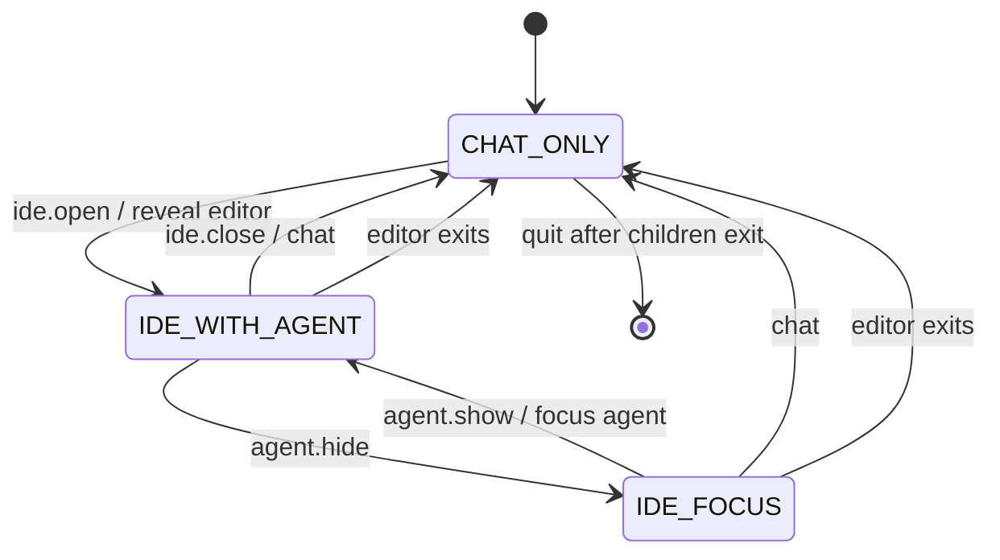

# PineVim Agent Harness Implementation Plan

Status: **Proposed architecture; planning/bootstrap complete; application not implemented.**

Discovery date: 2026-09-22. Target checkout: `~/Github/PineVim` (the filesystem also reports its parent as `~/github`). This document is the implementation contract, subject to the explicit feasibility gates below. Measurements and proposed targets are distinguished throughout.

## 1. Executive Summary

PineVim is a planned terminal workspace that preserves the user's Pi chat and provider workflow and adds their normal Neovim environment on demand. Start with chat, enter `/ide` to open an editor beside the same conversation, hide the agent to use the editor at full width, and restore it without restarting either application.

**Recommend a TypeScript/Node.js controller over a private tmux server, running the installed Pi interactive CLI and normal Neovim in separate panes.** A bundled Pi extension, supplied using `--extension`, translates PineVim commands into a small local control protocol. Pi renders chat and owns models, authentication, tools and conversation persistence. tmux provides the terminal emulator, PTYs, pane layout and input routing. PineVim owns the state machine and lifecycle policy. Neovim RPC is deferred.

This is architecture B with a deliberately small process-control bridge, not a custom terminal emulator. It fits the observed Pi 0.87.1 customization: the user's model picker installs a custom editor and terminal dialog, and Signal UI replaces the header/footer. Pi RPC degrades those APIs. Keeping the interactive Pi process preserves substantially more of this particular workflow than rebuilding chat around RPC. Installed tmux 3.7c supplies the missing pane substrate, while Neovim 0.12.4 already has LazyVim, terminals, navigation, LSP and persistence.

The visible product should have a single PineVim status strip, a consistent command prefix and no exposed tmux workspace-management ceremony. The underlying separation remains explicit. macOS and Linux are the MVP platforms; native Windows is not an MVP target. No architecture can promise arbitrary terminal compatibility without testing: extended keys, nested tmux and the custom picker in narrow panes are mandatory early gates.

## 2. Discovery Snapshot

### Evidence labels and limits

- **Observed:** read from local files or a read-only version command during this run.
- **Inferred:** expected behavior from installed code/configuration, not an interactive test.
- **Proposed:** PineVim behavior to implement and verify.

No provider was contacted, no interactive Pi session was opened, no user-configured Neovim startup was run, and no tmux server was created for this discovery. Normal startup can migrate Pi files or bootstrap/update Neovim plugins. Those actions were intentionally excluded from this read-only inspection. No working harness or terminal integration has been demonstrated yet.

### Local evidence index

Use these references when implementing; installed documentation is authoritative for the inspected version. Package paths below abbreviate `/opt/homebrew/lib/node_modules/@earendil-works/pi-coding-agent` as `<pi-package>` and `~/.local/share/nvim/lazy` as `<lazy-data>`.

| ID | Observed evidence | Architectural consequence |
|---|---|---|
| E01 | `~/Github/PineVim`: empty `README.md`, empty `.gitignore`, empty `Docs/`; no `.git`, source, manifest, existing decisions or project `AGENTS.md`; no applicable ancestor `AGENTS.md` found | Documentation can be populated without overwriting authored content |
| E02 | `/opt/homebrew/bin/pi` resolves to `<pi-package>/dist/bundle/cli.js`; `package.json` and `pi --version` report `@earendil-works/pi-coding-agent` **0.87.1** | Integrate this implementation, not an older similarly named Pi package |
| E03 | Package is ESM, requires Node `>=22.19.0`; installed Node **26.9.0**; exports SDK, `InteractiveMode`, `RpcClient` and `./rpc-entry`; dependencies include `pi-agent-core`, `pi-ai`, `pi-tui` | TypeScript fits public extension contracts; a reusable SDK exists |
| E04 | `<pi-package>/docs/{extensions,sdk,rpc,rpc-extension-ui,cli,configuration,models,sessions,session-format,keybindings,slash-commands,tmux}.md`; `dist/core/extensions/types.d.ts` | Public commands, lifecycle hooks, explicit extension paths, JSONL RPC and session APIs exist |
| E05 | `~/.pi/agent/settings.json`: default `google-vertex` / `gemini-3.8-flash`, theme `signal-neon`; quiet startup/editor padding settings; skill exclusion entries | Preserve Pi's settings and resource discovery; default model is observed, availability not verified |
| E06 | `~/.pi/agent/auth.json`: 23 provider records, **17 stored API-key literals and 6 OAuth records**, values not emitted; mode `0600`. `.env` exists with provider/cloud/skill variable names; mode `0644` | Credentials already exist; do not duplicate them; `.env` permissions merit a separately authorized correction |
| E07 | `models.json` absent; `models-store.json` has 23 provider catalog/cache groups with `models`, `checkedAt`, sometimes `etag`/`lastModified`; seven session JSONL files | Do not misclassify the catalog cache as custom endpoint configuration |
| E08 | Extensions: `model-picker/`, `signal-ui/`, `skill-compat/`, `orca-agent-status.ts`, `orca-prefill.ts`, `orca-titlebar-spinner.ts`; 93 direct skill directories; two Signal themes | Existing chat UX has meaningful custom behavior to retain |
| E09 | `model-picker/index.ts`: `ctx.mode === "tui"`, `ctx.ui.custom`, `setEditorComponent`, `/models`, Ctrl+L, `/model` interception; `config.ts` uses public `getAgentDir()` and writes picker preferences on model changes | RPC does not preserve this UX; PineVim must not replace its editor |
| E10 | `keybindings.json`: disables built-in `app.model.select`; maps labeled tree filter to Ctrl+B. `signal-ui/index.ts`: header/footer/indicator and `/signal`; theme sync can apply a Theme instance without rewriting settings | Avoid Ctrl+B/Ctrl+L for harness routing; keep extension UI ownership |
| E11 | `skill-compat/index.ts`: skill-only env allowlist, optional `skill.env`, prompt augmentation; Orca helpers check `ORCA_*` context | Do not source `.env` wholesale or invent Orca pane identity |
| E12 | `dist/main.js`: `--version` exits before migrations **but after** bootstrap `SettingsManager.create`; `FileSettingsStorage.withLock` creates/removes a settings lock even for reads | The version probe caused a transient lock and directory metadata change; future strictly read-only discovery must read package metadata instead |
| E13 | `/opt/homebrew/bin/nvim --version`: **NVIM v0.12.4**, LuaJIT; `/opt/homebrew/bin/tmux -V`: **3.7c**; Git **2.54.0** | Installed POSIX tools support the selected approach |
| E14 | `~/.config/nvim/init.lua` loads `config.lazy`; `lua/config/lazy.lua` bootstraps lazy.nvim and imports `lazyvim.plugins` then `plugins`; checker enabled | Launch normal Neovim; do not replace init or invoke bootstrap during planning |
| E15 | `lazy-lock.json`: LazyVim `999700997f72227187d49d8b92667183dc7fc809`; lazy.nvim, Snacks, lualine, bufferline, persistence, nvim-lspconfig, Mason, blink.cmp, conform, treesitter, trouble, noice, which-key | Existing IDE capabilities are present in the configuration/installed plugin tree |
| E16 | `lua/config/{options,keymaps,autocmds}.lua` are comment-only; `lua/plugins/colorscheme.lua` enables transparent Tokyonight; `example.lua` immediately returns `{}`; `lazyvim.json` extras empty | Example plugin declarations are inactive; no configured AI plugin found |
| E17 | `<lazy-data>/LazyVim/lua/lazyvim/config/{keymaps,options,autocmds}.lua`, `plugins/{util,ui,editor}.lua`, `plugins/lsp/init.lua` | Effective defaults matter more than empty user override files |
| E18 | LazyVim defaults: Space leader; Ctrl+H/J/K/L window navigation; Ctrl+arrows resize; Ctrl+/ and Ctrl+_ Snacks terminal; Ctrl+S saves; `<leader>qq` quits; `<leader>q{s,S,l,d}` persistence actions | Keep all these keybindings; harness prefix should be separate |
| E19 | LazyVim sets mouse `a`, truecolor, SSH-sensitive clipboard; root detection uses LSP, `.git`/`lua`, cwd; persistence writes on `VimLeavePre` | SSH/clipboard/root behavior must remain user-owned; no guarantee of identical tool roots after editor navigation |
| E20 | `/opt/homebrew/share/man/man1/tmux.1`: direct argv execution for pane commands, zoom, resize, remain-on-exit, pane-died/client-resized hooks; installed Pi `docs/tmux.md` recommends CSI-u for tmux >=3.5 | Avoid shell-wrapped pane launches; use tmux's existing terminal machinery |
| E21 | `/opt/homebrew/share/nvim/runtime/doc/{starting,api}.txt`: `--listen`, Msgpack-RPC, `--cmd`, `NVIM_APPNAME`; no local RPC customization found | RPC/injected runtime can be added later without editing personal config |
| E22 | No `~/.tmux.conf` or `~/.config/tmux/tmux.conf` found; inspection environment has TERM/COLORTERM but no TMUX/SSH_CONNECTION | Does not prove which emulator the user normally uses; nested tmux/SSH remain test cases |

Observed Pi provider IDs: `openrouter`, `anthropic`, `github-copilot`, `kimi-coding`, `openai-codex`, `xai`, `deepseek`, `nvidia`, `opencode`, `google`, `google-vertex`, `huggingface`, `cloudflare-ai-gateway`, `groq`, `openai`, `vercel-ai-gateway`, `moonshotai`, `mistral`, `zai`, `baseten`, `minimax`, `xiaomi`, `radius`. A stored record is not proof of valid authentication or a currently accessible model. No configured local endpoint or custom-provider registration was found in the inspected user resources. Provider aliases are Pi's concern; display groupings in the picker are not provider aliases.

User-level `AGENTS.md`, `SYSTEM.md`, `APPEND_SYSTEM.md` and `prompts/` were absent in the inspected agent directory. Pi can still discover parent/project instructions. Session inspection recorded schema keys and entry/role types only, not conversation text. `~/.pi/backups/` exists and was not unpacked.

### External cross-checks

The public extension documentation confirms explicit-path loading and command registration; the installed version's definitions remain the implementation reference. [Pi extensions](https://pi.dev/docs/latest/extensions).

The current tmux manual confirms pane terminals, zoom/layout operations and process separation. Its descriptions supplement the installed 3.7c manual; do not assume features in newer documentation exist in older installations. [tmux manual](https://man.openbsd.org/tmux).

## 3. Existing Pi Architecture

Pi is an ESM Node CLI backed by `@earendil-works/pi-agent-core`, `pi-ai` and `pi-tui`. The public `createAgentSession` SDK exposes an `AgentSession` with prompting, tools, model state, event subscriptions, compaction and abort. `SessionManager` owns the authoritative persisted entry tree; `AgentSessionRuntime` replaces sessions for new/resume/fork/import operations. SDK objects must be rebound after replacement. Do not assign private message arrays or import `dist/core/*` into PineVim.

Interactive Pi supplies the input editor, markdown/tool rendering, model selection, queueing, prompt expansion, slash commands and extension UI. Built-in enabled tools default to read/bash/edit/write; additional grep/find/ls and provider/extension tools are available. Extensions can register tools, providers, commands and shortcuts and observe session/run/model events. User and trusted project resource loading belongs to Pi. Prompt augmentation from `skill-compat` must continue unchanged.

Pi persists session headers and typed JSONL entries, including messages, model changes and thinking-level changes, under `~/.pi/agent/sessions/` grouped by working directory unless Pi overrides select another directory. Branches/compaction are Pi data, not a second PineVim transcript. `/resume`, `/tree`, `/fork`, `/clone`, `/new`, `/session` and `/compact` remain native.

Authentication supports saved literal API keys, OAuth refresh, environment-based keys, ambient cloud credentials, and custom model credential interpolation/commands. `models-store.json` caches catalogs; `models.json` would configure compatible endpoints and overrides. Opening model selection can refresh discovery. The custom picker uses `ctx.modelRegistry`, `pi.setModel`, and a replacement input component that intercepts `/model`; `/models` and Ctrl+L open its provider-first UI. Switching records session state; explicitly saving a default is separate.

Machine-readable interfaces exist: JSON event output for one-shot runs and persistent JSONL stdin/stdout RPC, plus exported `RpcClient`. RPC supports dialogs and notifications but not arbitrary custom terminal components; header/footer/editor replacement becomes unavailable or a no-op. `InteractiveMode` is exported, so embedding is possible, but it does not by itself render a Neovim PTY in another half of the screen. A custom compositor still needs a terminal emulator and lifecycle management.

## 4. Existing Neovim Architecture

This is a small LazyVim starter-style configuration with a substantive installed plugin ecosystem. It uses Lua, lazy.nvim, a committed-style `lazy-lock.json`, an empty extras list and one active appearance override. `.neoconf.json` contains Lua-development configuration. The sample plugin file is inactive and must not be treated as installed customization.

Snacks supplies terminal/picker/explorer facilities through LazyVim defaults and imported plugin specs; lualine and bufferline provide status/buffer UI. Space-leader file navigation, buffer actions, tab actions and Ctrl-window movement coexist with Snacks' terminal shortcuts. LSP is implemented through nvim-lspconfig and Mason integrations, with blink completion, formatting/linting and treesitter. PineVim does not reproduce them.

Persistence.nvim saves editor sessions on normal exit and offers explicit restore/select/stop actions. It is not proof that unsaved buffers or arbitrary running jobs can be resurrected after process termination. Hidden-editor continuity will retain the live process instead. Default autocommands supply ordinary editor behaviors; no PineVim marker/RPC setup or custom terminal orchestration was found.

Configuration is mostly portable Lua but depends on installed plugins, git/network bootstrap, tools/LSP servers, terminal fonts and clipboard availability. TrueColor/transparency and Nerd glyph appearance depend on the outer terminal. A normal launch may update data/cache/state and plugin lock/config artifacts as part of the user's tooling; the harness must not initiate installs, sync or config rewrites.

MVP uses option A, normal user Neovim. Options B/D, a bundled integration runtime/plugin injected through startup arguments, remain possible later. Option C, `--listen` with a private socket, is the preferred later context bridge. Do not set `NVIM_APPNAME=pinevim`, `-u NONE` or `--clean` in production: those would bypass the environment being integrated.

## 5. Product Requirements

| ID | Requirement |
|---|---|
| PINE-FR-001 | `pinevim` starts real interactive Pi in chat-only mode; no Neovim process required |
| PINE-FR-002 | `/ide` opens or reveals one normal Neovim process for the workspace |
| PINE-FR-003 | Sufficient terminal width displays editor left and the same Pi process right |
| PINE-FR-004 | Agent can be hidden with `/pinevim agent hide` or F12 then A |
| PINE-FR-005 | Restoring agent preserves Pi PID, session, in-flight run and provider/model |
| PINE-FR-006 | Hiding/restoring agent preserves Neovim PID, buffers, cursor and undo state |
| PINE-FR-007 | Use Pi's existing providers/authentication/settings/extensions without secret copies |
| PINE-FR-008 | A future packaged executable is named `pinevim` |
| PINE-FR-009 | `/ide close` returns to chat while parking the live editor; `/ide` restores it |
| PINE-FR-010 | Neovim normal exit/crash leaves Pi available and permits editor restart |
| PINE-FR-011 | Pi failure does not kill Neovim; explicit retry can resume the last known Pi session |
| PINE-FR-012 | Layout/focus/resize changes never submit prompts or editor keystrokes |
| PINE-FR-013 | All children start from one validated canonical workspace directory |
| PINE-FR-014 | Native Pi commands and custom model picker retain their existing behavior |
| PINE-FR-015 | Safe shutdown never automatically discards Neovim unsaved buffers |
| PINE-FR-016 | Narrow screens use explicit focus switching, without destroying either child |
| PINE-FR-017 | Configuration and compatibility failures have actionable local diagnostics |
| PINE-FR-018 | Session recovery and provider errors never automatically replay a tool action |
| PINE-FR-019 | No global config rewrites, remote creation, telemetry or credential export by PineVim |

## 6. Non-Functional Requirements

Targets below are proposed release gates, not measured performance:

- Warm controller overhead under 250 ms p95 before launching Pi; record Pi/extension startup separately. Reveal/hide of live panes under 100 ms p95, excluding child redraw, at 120×30 on the development machine.
- Input is routed by tmux directly, not through asynchronous application-level byte buffering. Controller idle CPU below 1% of one core over 60 seconds; avoid high-frequency polling.
- One serialized state writer and bounded control messages. Repeatable operations must be idempotent. A failed command must not leave UI metadata claiming a successful layout.
- Normal client cleanup restores terminal modes. Peer failures preserve the other pane. Private sockets and sanitized, bounded diagnostics are mandatory.
- macOS/Linux, local terminal and SSH, 256-color/TrueColor, Unicode and ASCII fallback require tests; visual identity cannot depend on emoji widths or Nerd Fonts.
- Public Pi APIs only; initial compatibility target Pi 0.87.1, tmux >=3.5, Node >=22.19.0 and the observed Neovim 0.12.4. Establish a lower Neovim minimum only through CI; this user’s LazyVim version may have stricter requirements than the harness. Broaden the Pi range only after contract tests.
- Isolation means lifecycle boundaries, not an OS sandbox. Pi tools and Neovim plugins retain the user's permissions.

## 7. Explicit Non-Goals

No replacement editor, agent loop, provider catalog/auth layer, LSP, custom terminal emulator, browser GUI, web IDE, automatic plugin installer, automatic config migration, multiple workspaces per UI, multiple agents, or native Windows support in MVP. No automatic editor buffer upload, autonomous RPC editing, permission elevation or promised restoration of unsaved buffers after shutdown. No repository implementation files are created during this planning task.

## 8. User Experience Specification

### Startup and workspace

`pinevim` uses the caller's cwd. `pinevim .` resolves the same directory. `pinevim /path/to/project` resolves the supplied existing directory using realpath, checks it is accessible, and starts both children there. Shell-expanded `~` is supported; literal-tilde expansion, if accepted, is limited to the current user's home. Never create a missing workspace silently or reinterpret an arbitrary file as a directory.

Do not silently change to Git root: a chosen subdirectory is meaningful to Pi's session grouping. Store canonical path and a display path. The status strip always identifies the workspace. A single live workspace controller is allowed per canonical directory in MVP; a second invocation prints a recovery hint rather than sharing one transcript writer.

### Layout and transitions

```text
CHAT_ONLY                   IDE_WITH_AGENT (wide)              IDE_FOCUS
┌────────────────────┐      ┌──────────────────┬───────────┐   ┌──────────────────────────┐
│ Interactive Pi     │      │ Normal Neovim    │ Same Pi   │   │ Same Neovim              │
│                    │      │                  │           │   │ Pi alive, hidden         │
└────────────────────┘      └──────────────────┴───────────┘   └──────────────────────────┘
 PineVim status strip        PineVim status strip               PineVim status strip
```

A one-row status strip shows workspace, mode, active pane, agent running/waiting/error and `F12 ? help`. No chat transcript or secrets in that strip. In chat-only mode there is no editor-sized empty pane. `/ide` launches Neovim only once, creates editor-left/chat-right layout and focuses the editor after successful creation. Repeated `/ide` is idempotent and reveals/focuses the existing editor.

Default agent width is `clamp(round(0.35 × (columns − 1)), 40, 64)`. Editor gets remaining width; reserve one vertical border and one status row. Side-by-side mode requires at least **101 columns × 24 rows**, giving editor ≥60 and chat ≥40 columns. This is a proposed usability threshold, not a Pi-enforced limit. Users can resize with F12 then Left/Right in 5-column steps, constrained by minima, or drag the tmux border. Remember the chosen ratio and clamp on resize.

At ≥60 columns and ≥16 rows, when either width is below 101 columns or height is below 24 rows, retain IDE_WITH_AGENT as the desired mode but use a single visible pane at a time; F12 then Tab changes the visible focus. Entering `/ide` focuses the editor and status explains how to return. Widening restores the split unless the user explicitly hid the agent. Below 60×16, keep existing processes alive and show a compact size warning; do not attempt zero-size panes. Fresh interactive launch below that size exits with a resize instruction before children start. Non-TTY or TERM=dumb fails before tmux creation. Extremely small terminals may only display the warning's first line.

`/pinevim agent hide` or F12 then A zooms the editor, without aborting Pi. A second F12 then A restores the previous split/compact mode and focuses chat. `/pinevim agent show` is idempotent, useful in scripts/command completion; in CHAT_ONLY it keeps chat visible and does not create an editor. F12 then Tab switches focus; from IDE_FOCUS it reveals chat and changes to IDE_WITH_AGENT.

`/ide close`, `/pinevim chat` or F12 then C returns to chat-only by zooming chat and keeping Neovim alive. “Close” means close the IDE view, not discard editor buffers. Status/help must say “editor running, hidden.” Reopen with `/ide` or F12 then I. To actually stop Neovim, focus it and use `:qa`/`:wqa` or the user's existing `<leader>qq`; Neovim handles modified-buffer refusal.

`/pinevim quit` or F12 then Q requests application shutdown. If Neovim is alive, focus it and display “Quit Neovim with :qa or :wqa, then repeat PineVim quit”; never type those commands on the user's behalf. With editor exited, cancel/drain active Pi work through the bridge (confirm cancellation if busy), invoke public shutdown, then remove only the owned workspace resources (and server/runtime endpoints only when no other jobs remain). Pi's `/quit` still quits Pi: if an editor lives, it remains with a recovery banner; if no editor lives, finish application shutdown. Normal Pi EOF/Ctrl+D follows the same rule.

## 9. UI State Machine

The **AppController** is the sole authority. Pi extension, prefix helpers and tmux lifecycle hooks emit typed intents/events. None independently declares a durable state transition. Track `mode`, `focus`, child liveness, readiness, terminal size, desired ratio and operation generation separately. `compact` is a layout property, not a fourth product mode.



| Event | Starting state | Result / invariant |
|---|---|---|
| IDE_OPEN | Any | Check nvim executable; spawn only if absent; on success show pair and editor focus; spawn failure leaves previous state |
| AGENT_HIDE | IDE_WITH_AGENT | IDE_FOCUS; Pi PID/session unchanged |
| AGENT_HIDE | CHAT_ONLY | Reject with “open IDE first”; never hide sole live chat |
| AGENT_SHOW | IDE_FOCUS | IDE_WITH_AGENT; agent focus; same Pi process |
| CHAT | Any live Pi | CHAT_ONLY, editor parked if alive |
| EDITOR_EXIT | Any | Record code/signal; remove dead editor pane; CHAT_ONLY if Pi lives; otherwise retain diagnostic/retry surface; notification on nonzero/signal |
| AGENT_EXIT | Editor alive | Present IDE_FOCUS with agent unavailable; retain prior desired mode for explicit recovery; prefix remains available |
| AGENT_EXIT | No editor | Clean exit for expected code 0; otherwise retain diagnostic/retry choice before exiting nonzero |
| RESIZE | Any | Recompute presentation from desired mode/ratio; no session mutation |
| PROVIDER_ERROR | Any | Pi owns retry/error; no UI mode or child lifecycle change |
| BRIDGE_LOST | Any | Disable Pi command actions and show disconnected state; tmux prefix controls still function; reconnect generation required |
| SHUTDOWN | Any | Enter controller stopping lifecycle only after editor exit policy succeeds; drain/stop Pi; clean owned resources |
| Terminal detach/HUP | Any | Preserve server/panes for explicit `--resume`; do not interpret transport loss as permission to kill editor |

Pending spawn/layout transitions have operation IDs and deadlines. Serialize intents and reconcile actual pane IDs after mutations. On error, query layout/liveness, restore the last viable view, then update metadata. A repeated hide/open request must not toggle accidentally. A Pi reload or session replacement is not an application shutdown: generation-aware bridge disconnects and `session_shutdown` are distinct from actual pane death.

## 10. Architecture Alternatives

| Criterion | A: custom parent TUI + PTYs | B: private tmux + interactive Pi **selected** | C: Neovim-centric Pi terminal | D: custom UI + Pi RPC + Neovim PTY/RPC |
|---|---|---|---|---|
| Current Pi fit | High if terminal fully emulated | Highest: original interactive UI | High inside Nvim terminal, with key layering | Agent APIs high; existing custom UI low |
| Current Nvim fit | Depends on emulator fidelity | Native terminal process/config | Native editor is the root application | Native terminal or extensive remote-UI work |
| Chat-only | Yes, custom compositor still active | Yes, one Pi pane; no Nvim process | Requires hidden/editor host from start | Yes, newly built chat |
| Split and minimize | Must implement terminal views | Existing split/zoom primitives | Nvim windows/terminal buffers | Custom layout and terminal view |
| Session continuity | Requires correct PTY lifetime | Same child processes throughout | Buffer/job lifetime must survive closes | Agent session via RPC; editor separately |
| PTY/ANSI complexity | Very high: emulator, damage, modes | Low in PineVim; delegated to tmux | Low–medium; Nvim terminal behavior | High for editor PTY; custom chat too |
| Resize/input/focus | Entire routing implementation | tmux routing, controller layout policy | Terminal-mode escape and Nvim maps | UI framework plus terminal encoding |
| Slash routing | Needs public extension anyway | Pi parses, extension sends intents | Extension sends Nvim/control actions | Reimplement interactive commands or adapter |
| Mouse/clipboard | Emulator passthrough security work | tmux behavior; OSC52 policy/testing | Nested terminal quirks | Separate implementations and policies |
| Terminal compatibility | New emulator compatibility burden | Mature tmux, extended-key/nesting limits | Neovim UI plus nested Pi constraints | New frontend + editor emulator burden |
| Providers/secrets | Reuse Pi child or SDK | Native Pi source of truth | Native Pi source of truth | Reuse RPC; do not rebuild providers |
| User config | Preserve if launch correct | Explicit extension path, normal nvim | Integration plugin/keymaps needed early | Normal nvim plus richer integration |
| Cross-platform | Native PTY bindings and emulator | POSIX; WSL later, no native Windows | Nvim portable; terminal job differences | Platform-specific PTYs or remote UI |
| Dev/test complexity | Highest terminal conformance work | Medium, focused lifecycle/terminal gates | Medium but compromises product model | High, command/render parity tests |
| Dependencies/performance | PTY + emulator + TUI; extra rendering | External tmux + small Node controller | Nvim always resident; plugin coupling | TUI/PTy/RPC packages; rendering overhead |
| Failure isolation | Good with children, host critical | Good; server can outlive controller | Editor death takes host/chat down | Good children; frontend/controller critical |
| Maintainability | Own terminal machinery indefinitely | Versioned adapter + stable tmux CLI | Coupled to editor window/session behavior | Own Pi UI/interactive-command parity |
| Extensibility | Maximum UI control at high cost | Add private Nvim RPC later | Good editor context, weaker independence | Excellent context APIs, poorer reuse now |

B still has costs: an external dependency, tmux-mediated key/image/clipboard behavior, nested tmux prefix conflicts and no pixel-level unified theme. These are measurable risks. A and D would replace substantial working terminal UX before delivering the minimal product. C contradicts a first-class chat-only mode without starting Neovim and makes editor failure the whole product's failure.

### Stack comparison

| Stack | Fit | Decision |
|---|---|---|
| TypeScript + Node built-ins + tmux | Same language as Pi extension/types; one protocol/type definition; no native PTY addon | **Selected**, ESM build with `tsc`; runtime built-ins for processes/net/fs/CLI |
| Go + tmux | Compact binary and good subprocess APIs; still needs a TypeScript Pi extension and shared schema/code generation | Realistic alternative, extra language boundary buys little for MVP |
| Rust + PTY/emulator/TUI | Strong control and possible future standalone distribution | Rejected for MVP; must solve the hardest terminal rendering problem and maintain a TS bridge |

## 11. Architecture Decision

**ADR-001: preserve interactive Pi, delegate terminal composition to tmux.** Evidence E03/E09 and RPC limitations make preserving the existing renderer/editor material, not cosmetic. E13/E20 demonstrate installed pane support. E14–E19 show no need for a custom editor integration plugin for layout.

PineVim launches its own tmux server using a unique absolute socket path and an explicitly generated minimal configuration; it never operates on the default/user server. The tmux client is the only process reading/writing the outer terminal once attached. Node remains the supervisor and owns state, using subprocess commands and a private Unix socket for control. tmux server owns all pane PTYs and child lifetimes. Node does not copy ANSI bytes into a custom canvas.

No public Pi API is assumed permanently stable. Put all Pi-version knowledge in `adapters/pi/` and all tmux commands/escaping in `adapters/tmux/`. For 0.87.1, use public extension APIs and CLI flags. Package a compiled extension with the harness and pass its absolute path with `--extension`; do not install into `~/.pi`.

**Release gate:** if nested tmux/extended keys/custom picker fidelity cannot pass early testing, revisit ADR-001 before implementing the rest. The fallback is not an invisible replacement with RPC: compare a parent terminal compositor retaining interactive Pi against explicitly accepted chat-UI changes. Native Windows and image fidelity may eventually warrant another transport backend.

## 12. Process Model

```text
user shell
└─ node .../pinevim/dist/cli.js                 supervisor / AppController
   ├─ tmux -S <private-socket> attach-session  foreground terminal client
   └─ short-lived tmux commands / control helpers (no shell interpolation)

private tmux server (daemonized; not necessarily Node's enduring OS child)
└─ one PineVim session / one managed workspace window
   ├─ PTY → installed pi --extension <bundled-extension.js>
   │        ├─ public PineVim extension → controller Unix socket
   │        └─ Pi tools/provider requests/user extensions
   └─ PTY → installed nvim                     created only on /ide
            └─ user's normal plugins / LSP / terminals
```

The tmux client inherits the real terminal descriptors; the controller never enables raw mode or reads stdin concurrently. Before attach and after detach it may print startup/recovery diagnostics. Hooks execute the packaged helper through the narrow fixed shell boundary described in section 19.

The logical ownership tree is not the OS parent tree. Do not assume killing Node reaps a daemonized tmux server or its children. Record server/session/pane identities; scope all control using the private socket and immutable IDs, not pane indexes or names.

One managed visible window holds the two persistent panes once editor starts; zoom chat implements CHAT_ONLY with a parked editor, zoom editor implements IDE_FOCUS, unzoom shows split. There is no need to move processes between PTYs for these transitions. When entering a narrow mode before a second pane exists, use a controlled tmux window-size strategy to create both at viable dimensions then zoom the selected pane; prove the resize sequence in Phase 0, and never claim a split if creation failed.

## 13. Component Architecture

| Component / proposed file | Responsibility |
|---|---|
| `src/cli.ts` | Parse public CLI; validate cwd/TTY; load config; acquire workspace lock; start/attach controller |
| `src/core/controller.ts` | Serialize intents, lifecycle policy, generation IDs, shutdown and reconciliation |
| `src/core/state.ts` | Pure transitions/invariants over mode, focus, child readiness and terminal geometry |
| `src/core/layout.ts` | Split sizes, compact behavior, zoom target and resize intent |
| `src/adapters/tmux/{client,config,events}.ts` | argv-safe commands, pane creation, prefix/hook configuration, event intake and liveness queries |
| `src/adapters/pi/{adapter,extension,compatibility}.ts` | Installed Pi invocation, public API bridge, session identity, reserved commands/version gates |
| `src/editor.ts` | Normal Neovim launch spec and exit classification; no remote editor API in MVP |
| `src/control/{protocol,server,client}.ts` | Versioned, bounded JSONL over private Unix socket; helper entrypoint for tmux keys/hooks |
| `src/persistence.ts` | Controller metadata only, private permissions, atomic replacement, recovery validation |
| `src/config.ts` | Declarative PineVim UI/process options and platform paths; no credential parser |
| `src/diagnostics.ts` | Allowlisted structured logs and sanitized startup/error messages |

There is no MVP chat renderer, provider SDK, PTY library, input-byte router, custom slash parser for Pi commands, Neovim plugin or RPC bridge. “Pi Adapter” is a process/control contract rather than an abstraction that promises substitutable chat frontends: another agent must implement its own compatible command bridge and interactive child contract.

## 14. Pi Integration Design

Launch resolved installed Pi directly in a tmux PTY with working directory and inherited Pi environment. Supply only the explicit extension path and, for recovery, a Pi-supported session selector. Do not silently add `--no-extensions`, `--no-skills`, `--approve`, a replacement system prompt, `--api-key` or a new agent directory. Keep Pi's regular/fullscreen preference; test both rather than force a change for aesthetics.

The extension registers `ide` and `pinevim` using `pi.registerCommand`. It does not call `setEditorComponent`, `setHeader` or `setFooter`, preserving E09/E10. Use a uniquely named `ctx.ui.setStatus` only if it composes with Signal; the tmux status strip is authoritative if custom footer does not display it. Terminal input and output travel directly Pi ↔ tmux; there is no transcript scraping.

Start the extension connection on `session_start`, close session-scoped handles idempotently on `session_shutdown`, and reconnect after `/reload` or session replacement. A handshake carries protocol version, process generation, `ctx.cwd`, Pi session ID/file reference from public read-only session methods, command capability results and minimal busy state. Do not send prompts, tool payloads, credentials or full environment. Session file can initially be undefined; re-announce after creation and on session/run boundaries. Model/provider IDs may be sent as transient status, never become an authoritative configuration copy.

Use `agent_start`/`agent_settled` and public `ctx.isIdle()`/queue information to display running/waiting accurately; `agent_end` alone can precede retries/queued continuation. The controller requests graceful shutdown via the bridge; use `ctx.abort()` when cancellation was explicitly selected, then `ctx.shutdown()` after idle. Store fresh contexts only for their active generation. No private `extensionRunner` access. On controller disconnection, keep Pi running and reconnect with bounded backoff (250 ms to 5 seconds); preserve instance/token-file identity for recovery, re-handshake with a fresh controller epoch, and drop outstanding actions rather than replaying them. An extension handler must not await a controller action that in turn waits for that same handler to finish; acknowledge shutdown intent first and perform drain/exit out of band.

Bridge records have `{version, requestId, generation, type, payload}` and correlated success/error replies. Limit a record to 16 KiB, enforce schema/enums, cap queued requests at 64, use 2-second acknowledgment and 10-second operation deadlines with recoverable timeout state. An absent acknowledgement is not permission to replay a tool or restart Pi. Detect actual pane exit separately.

Compatibility testing starts with the observed Pi 0.87.1; record version/capabilities. An unknown version produces an explicit unsupported-version message before an IDE transition; chat may still run in clearly marked unintegrated mode if the user selects it. Never auto-update/downgrade Pi or import private installed modules. A Pi upgrade requires extension type-check and isolated compatibility tests before expanding the support matrix.

## 15. Provider Integration Design

**PineVim gains Pi's provider capabilities by launching the same Pi with the same agent directory and environment, not by reading and translating provider files.** The child discovers credentials, catalogs, provider extensions, trusted project settings and model defaults through its own normal mechanisms. `/login`, `/logout`, `/model`, custom `/models`, Ctrl+L, `/thinking` and model cycling remain Pi-owned.

Credentials remain in existing Pi auth storage/environment/ambient cloud stores. PineVim never supplies credentials on argv, mirrors auth records into its metadata, or adds its own provider settings. It does not load `.env`: the observed skill compatibility extension imports only selected skill keys, while provider auth is separately configured. Inherit the launcher's Pi-relevant environment to preserve existing behavior; never dump it or pass newly resolved Pi credentials back to the controller/editor.

Saved `auth.json` includes literal and OAuth credentials in this environment, not merely env references. Pi itself resolves precedence: runtime overrides, saved auth, custom-model credentials, environment/ambient credentials as applicable. PineVim supplies no runtime provider overrides. Registry/provider IDs are canonical; display labels remain the picker’s business. Existing stored defaults and resumed per-session models retain Pi semantics. No local endpoint was observed; future compatible/local providers work by configuring Pi once, not a PineVim form.

### Preservation boundary: explicit technical limitation

For **this planning run**, `~/.pi` was intended to be strictly read-only. Final verification found one exception: the nominally informational `pi --version` probe created/removed a transient settings lock, changing agent-directory metadata. No persistent configuration/session file edits were detected; see Appendix B. This is a safety-verification exception, not a passed unchanged-tree gate. For the proposed future native-Pi mode, PineVim itself never writes those files, but **Pi and its loaded extensions can**: session appends, OAuth refresh, settings selected by the user, catalog updates, migrations, picker recents. The installed source proves this. Claiming full native compatibility and an immutable `.pi` directory at runtime would be false.

Document this behavior before first real use; no harness-initiated migration/copy is allowed. If future requirements demand OS-enforced read-only `.pi` even for Pi, that is a separate integration mode requiring an SDK-backed read-only credential adapter and external session storage, plus compatibility changes for existing extensions/OAuth. It is not solved by a symlink or `--session-dir` alone. Do not promise that mode in MVP.

## 16. Neovim Integration Design

Spawn the resolved `nvim` executable directly with the canonical workspace cwd, a real tmux PTY and default user configuration. Set `PINEVIM=1` and a nonsecret workspace/session marker for optional future user integrations. Preserve caller `NVIM_APPNAME` if intentionally set; otherwise normal `nvim` remains the config target. Do not force a different HOME/XDG config/data path. Set/unset inherited remote-editor variables such as `NVIM` only after testing startup from a Neovim terminal; never attach to the parent editor by accident.

MVP does not inject a runtime path or plugin and does not open a PineVim-specific RPC socket. Neovim can create its own normal local server as part of standard startup; “RPC deferred” means PineVim does not connect or depend on it. Layout is a tmux concern.

Normal exit removes only the editor pane and returns to chat. Signal/nonzero exit reports an editor failure with exit metadata, not an arbitrary stderr dump. `/ide` after exit starts a new Neovim process; it does not claim to restore unsaved buffers. Existing LazyVim persistence can be restored by the user with its normal keys. `/ide close` while alive preserves the exact live editor state by zooming chat.

Future phase: `nvim --listen <private-unix-socket>` with a bundled runtime loaded via explicit startup arguments if needed; use Msgpack-RPC to query current file/selection/diagnostics and implement deliberate navigation. No TCP listener, global plugin install or overwrite of user keymaps. Buffer content transfer needs explicit user intent; changedtick/version checks are required before applying edits. None is necessary to ship the initial three-state UX.

## 17. Command Architecture

Pi parses submitted chat text. PineVim's extension parses only arguments for its two registered commands. All other commands remain native Pi inputs; PineVim does not forward them through a new parser or inspect raw input bytes.

| Command / key sequence | Owner | Contract |
|---|---|---|
| `/ide` or `/ide open` | PineVim extension → controller | Create/reveal editor; show agent; focus editor |
| `/ide close` | Same | Return to chat, park live editor |
| `/pinevim ide [open\|close]` | Same | Namespaced equivalent; long-term canonical form |
| `/pinevim agent hide` | Same | IDE_FOCUS; reject if no editor |
| `/pinevim agent show` | Same | Show/focus chat without creating editor |
| `/pinevim chat` | Same | CHAT_ONLY; keep editor live |
| `/pinevim status` | Same | Mode/workspace/child availability/version, no secrets |
| `/pinevim help` | Same | Exact commands, prefix, close-versus-quit explanation |
| `/pinevim quit` | Same | Safe application shutdown policy |
| F12 then I / C | Private tmux prefix table | IDE / chat intents, available in either app |
| F12 then A | Same | Toggle agent visibility when editor exists |
| F12 then Tab | Same | Focus other pane; reveal agent if hidden |
| F12 then Left / Right | Same | Decrease/increase agent width by 5 columns |
| F12 then Q / ? | Same | Quit request / concise help |
| F12 then R | Same | Explicit Pi retry/recovery when dead; no action when healthy |
| F12 then F12 | tmux | Send literal F12 to focused application |
| `/model`, `/models`, `/login`, `/resume`, `/tree`, `/signal`, `/skill-compat`, `/quit`, other Pi commands | Pi and existing extensions | Preserve original meaning |

Do not reserve broad `/agent` or `/chat` names. Future harness subcommands belong beneath `/pinevim`; `/ide` is the required compatibility alias. Unknown PineVim subcommands return usage and never become model prompts. Unknown non-PineVim slash text retains the installed Pi behavior (including potential ordinary prompt handling); do not promise global “unknown command” rejection. Test without a live provider.

No collision was observed for `ide`/`pinevim`. Pi 0.87.1 resolves duplicate extension command names to suffixed invocation names in `resolveRegisteredCommands`; built-ins have priority in the interactive path. Do not override this or depend on private suffix ordering. At handshake and `/reload`, inspect public `pi.getCommands()` resource metadata plus a version-pinned built-in compatibility list to validate unambiguous ownership. Installed `dist/core/agent-session.js::_bindExtensionCore` confirms that public inventory names are resolved invocation names with `sourceInfo.path`; built-ins are excluded. Require exact `ide`/`pinevim` entries whose source path matches the bundled extension, and reject competing prompt entries. A suffixed name means the bare alias is unavailable; no need to predict suffix order. Verify this behavior with reload/collision fixtures in Phase 0. On an `ide` collision, report that bare `/ide` is unavailable, keep prefix and `/pinevim ide` available when unambiguous, and require the user to resolve the conflicting resource before claiming FR-002. On `pinevim` collision, disable slash integration and provide prefix recovery. Never silently disable another extension or edit its config.

F12 is proposed because inspected Pi/LazyVim mappings do not reserve it. Letter labels in this document denote lowercase keys (`a`, `i`, `c`, `q`, `r`), without Shift. It is a two-key sequence, not a simultaneous chord. F12 is intercepted only by the private server, with no global terminal mapping. Allow a user-configurable tmux-valid prefix; retain double-prefix literal passthrough. Function-key forwarding and OS interception remain a real-terminal test gate. Outer tmux must pass this prefix; do not rewrite outer config.

## 18. Input and Focus Routing

| State / active view | Keystroke recipient | Harness action path |
|---|---|---|
| CHAT_ONLY | Pi's existing editor/dialog | F12 prefix → helper → controller; slash command → extension |
| IDE_WITH_AGENT, editor focused | Neovim | Prefix consumed before child; Ctrl+H/J/K/L remain Nvim window movement |
| IDE_WITH_AGENT, chat focused | Pi | Ctrl+L remains custom model picker; regular Pi keys untouched |
| IDE_FOCUS | Neovim | Prefix A/Tab reveals agent; hidden Pi has no keyboard focus |
| Compact paired view | Selected pane only | Tab changes selected/zoomed pane; no queued keystrokes |
| Pi dead, editor live | Neovim | F12 R requests retry; no synthetic text injected into Nvim |

tmux owns terminal escape/key decoding and pane input; controller commands are separate IPC. Do not infer `/ide` by scraping rendered text, intercept Ctrl+C globally, or send fake escape/`:qa`/slash keystrokes to control state. Bracketed paste goes to the active child as a unit; pasted F12-looking bytes are not control messages. tmux must maintain input-mode correctness while a pane is hidden.

Focus changes commit only after pane existence/layout confirmation. Restore chat with focus on chat; hide chat with editor focus. Mouse click can select an exposed pane; controller observes active-pane changes and reconciles focus rather than fighting mouse selection. Border dragging updates the user ratio; resize-origin tagging prevents feedback loops. Resize never changes the desired mode by itself.

Prefix helpers must operate while Pi is streaming, in its model picker, or dead; they do not rely on a working Pi extension. Nested Neovim terminal jobs still receive their own ordinary keys. Unsupported modified key encodings degrade with visible guidance and preserved existing Pi fallback keys, not silent remapping of model shortcuts.

## 19. PTY and Terminal Architecture

### tmux transport contract

Use a dedicated server socket in a private runtime directory and a generated PineVim-only config; `-f` avoids reading a user tmux config for that server. Set a private session, stable IDs, `remain-on-exit on`, controlled status, no user plugins, and explicit prefix bindings. Clear default prefix command bindings in this server before installing the PineVim table; do not expose default pane-kill/window commands accidentally. Retain intentional mouse handling and literal-prefix passthrough. Set `extended-keys on` and `extended-keys-format csi-u` for the required tmux >=3.5 baseline (E20, installed Pi tmux guidance). Set appropriate `default-terminal` only after `tmux-256color` terminfo availability checks; use `screen-256color` fallback when necessary. Never claim unsupported truecolor capabilities.

Node `child_process.spawn/execFile` uses argv arrays and `shell:false`. tmux pane creation must also use its direct multi-argument executable form, not one constructed shell-command string. tmux still has its own command/format syntax: validate generated tokens and test paths containing spaces, quotes, dollar signs, semicolons and format markers. Do not interpolate cwd into hooks or format expressions. Hooks/prefix `run-shell` need a fixed packaged helper invocation with strict POSIX quoting of trusted executable/socket paths; dynamic event arguments are restricted numeric/enum identifiers. This narrow shell boundary must have injection tests.

Use `client-resized`, pane lifecycle and focus/layout hooks to notify the controller, plus bounded reconciliation after commands/reconnect. A low-rate liveness check (proposed 2 seconds while attached) can recover missed hooks; no pane-output subscriptions or high-volume capture in production. No custom PTY addon or ANSI renderer is needed. tmux continuously drains child output, including hidden panes, and redraws from its terminal state. Cap history (proposed 10,000 lines per pane); transcript history remains Pi's session data.

### Resize, terminal modes and compatibility

Outer emulator resizes tmux client → tmux server updates pane PTYs and SIGWINCH → Pi and Nvim redraw. Controller coalesces layout recalculation over 50 ms, with a maximum 150 ms delay; it does not delay tmux's own resize handling. Use actual pane cell dimensions, not a fixed initial size. Compact-mode backing sizes/zoom transitions must be demonstrated for 80×24, 60×16 and rapid threshold crossing. If second-pane creation cannot succeed safely at a size, leave chat and report the minimum rather than corrupt the session.

tmux handles alternate screen, cursor visibility, bracketed paste, terminal reset and UTF-8 cell drawing. Preserve the caller's UTF-8 locale; show an ASCII status fallback if needed. Do not add an image renderer or universal passthrough. Pi text should work in 256-color terminals; exact Signal/transparent-theme appearance is terminal dependent. LazyVim currently requests truecolor; test actual output before claiming color fidelity on limited terminals.

Mouse support is on for the private session where compatible: clicking focuses a pane and dragging resizes the border. App mouse events go to the selected pane. Document terminal modifier-select for copying text. Pi image paste/system clipboard and Neovim unnamedplus/SSH OSC52 are separate features: preserve each, test each. Set `allow-passthrough off` initially; clipboard escape handling must be explicit. Do not promise image-display parity through tmux without a tested terminal matrix.

For nested tmux, create the inner server with TMUX/TMUX_PANE removed from its startup environment to avoid accidentally targeting the outer server, while recording only that nesting exists. The outer pane becomes the inner client's terminal. Inner children receive legitimate inner tmux identifiers. Do not mutate the outer server or invent ORCA pane markers. Default native bindings may require outer prefix forwarding; explain it if a configured outer binding captures F12. Pi's skill-created tmux jobs must not become harness-owned children: track only known pane IDs and never use a broad default-server kill.

### Signals and cleanup

- Keyboard Ctrl+C in a pane goes to that child. Pi's clear/exit semantics and Neovim interrupt remain unchanged. Escape still aborts Pi; Ctrl+Z behavior is Pi's native suspend behavior and must be tested within a pane.
- Programmatic SIGINT to supervisor is a quit request; if editor is alive, preserve it and return to the safe quit workflow. Do not fan signals indiscriminately across panes.
- SIGTERM/SIGHUP/terminal disconnect cannot ask the user to save reliably. Persist metadata, detach, leave owned tmux panes recoverable and exit the controller/client. A second `pinevim --resume` can reacquire the lock and reconcile. No promise of process survival after OS reboot or tmux-server failure.
- Normal deliberate quit waits for editor exit, asks before aborting busy Pi work, requests Pi shutdown, observes pane exit, then removes the owned empty workspace session. Destroy the private server only after inventory confirms no untracked sessions/panes remain; Pi tools can themselves launch tmux jobs. Retain server/socket metadata if such jobs remain and report their existence without capturing their output. Timeout retains a recoverable pane and reports it; no automatic SIGKILL fallback.
- A tmux-server crash may terminate both PTYs; report it, retain Pi session references, and explain Neovim swap/persistence recovery rather than claim buffer safety.
- All shutdown handlers are idempotent. Validate server identity before cleanup; never run unscoped `tmux kill-server`. Remove owned sockets/metadata only after confirming no live owner. Do not attempt to reap unrelated tool daemons.

## 20. Session and Persistence Model

| State | Authority | Storage | Continuity |
|---|---|---|---|
| Conversation/tree/compaction/tool results | Pi SessionManager | Pi-configured JSONL | Same live session on every view transition |
| Provider/model/thinking | Pi AgentSession + persisted entries | Pi settings/session | PineVim never restores from a separate model field |
| Canonical workspace | Controller, validated against Pi handshake | Minimal PineVim metadata | Fixed for harness lifetime |
| Neovim buffers/undo/cursor/jobs | Live Neovim | Its own runtime/swap/persistence | Guaranteed only while same process survives |
| Pane PTYs/content/input modes | tmux server | Live server memory | Hidden panes remain live; not reboot persistence |
| Mode/ratio/focus/liveness/generation | Controller | Metadata with observed pane IDs | Reconciled with actual server; stale IDs never trusted |
| Pi session reference | Pi reports; controller caches reference | PineVim metadata, no transcript | Used only for explicit retry/resume after identity validation |

Hide/show and `/ide close`/reopen preserve both processes and all live state. Actual Neovim quit/reopen creates a new process; user restores editor files through existing persistence. Normal complete PineVim exit ends children; next bare `pinevim` starts a fresh Pi session in CHAT_ONLY. Native Pi `/resume` restores prior conversations. `pinevim --resume [directory]` first reconnects the surviving live workspace; if none survives, offers Pi's normal resume picker in CHAT_ONLY. It never resurrects an editor process or replays a task automatically.

During Pi `/new`, `/resume`, `/fork`, `/clone`, `/import` and `/reload`, refresh the cached session reference. Do not mistake `session_shutdown` for a dead process. Refuse controller adoption when handshake cwd differs from the canonical workspace. Do not silently switch the editor to another project; display the mismatch and require reopening PineVim at the intended directory. Editor `:cd`/`:lcd` and LazyVim LSP roots can intentionally differ; status retains the harness root, and no buffer automatically becomes agent context. Future RPC can display the difference more precisely.

Metadata schema v1 contains workspace, random instance ID, socket paths, server/session/pane IDs, Pi session reference, desired UI state, timestamps and compatibility versions. Exclude secrets, message bodies, editor contents and command output. Writes are atomic with `0600` files and `0700` directories. A per-workspace lock enforces one controller, with stale recovery validated by socket handshake/instance nonce rather than PID existence alone. Resume requires same UID and workspace; concurrent attaches are rejected in MVP to avoid competing size/focus control.

## 21. Configuration Architecture

Proposed POSIX locations, using absolute XDG overrides when supplied:

- User config: `${XDG_CONFIG_HOME:-~/.config}/pinevim/config.json`.
- State/logs: `${XDG_STATE_HOME:-~/.local/state}/pinevim/`.
- Transient sockets/generated tmux config: private `pinevim/<short-instance-id>` under valid user-owned `$XDG_RUNTIME_DIR`; otherwise `mkdtemp` under OS temporary directory, mode `0700`. Keep Unix socket paths short on macOS.

This cross-platform POSIX convention matches the terminal-tool workflow; avoid another macOS-only config hierarchy. No config is created by this planning task. On first implementation use, defaults need not create a config file at all.

Precedence for **PineVim-owned** fields is explicit CLI options → dedicated environment override (currently only `PINEVIM_LOG_LEVEL`) → PineVim user config → built-in defaults. MVP has no executable project config and no Pi config import/merge. Pi separately applies its native trust/settings precedence. Do not present these two systems as one merged precedence ladder.

Allow only UI ratio/minimums, prefix, executable absolute paths and log level in PineVim config. Provider keys/models are not PineVim fields. Unknown fields and invalid types produce line/path diagnostics without echoing values; never overwrite a malformed file. Executable overrides must be a path, not a shell expression. Project-local `.pi` resources remain subject to Pi's trust UI; PineVim never automatically approves them.

## 22. Logging and Diagnostics

Public CLI: `pinevim [directory]`, `pinevim --help`, `pinevim --version`, `pinevim --resume [directory]`. The last flag exists for recovery; keep model/provider flags out of MVP. `--help`/`--version` do not start Pi/Nvim/tmux or load arbitrary extensions. Version output distinguishes harness version from optionally inspected executable versions and never prints config values.

Debug logging is opt-in via `PINEVIM_LOG_LEVEL=debug` or user config, not a second family of CLI switches. Use Node built-ins for a small structured logger. Log event type, operation ID, mode, duration, exit code and bounded categorized errors. No raw PTY recording, prompts, credentials, HTTP headers, full env, OAuth links, private cwd listings or arbitrary exception objects. Home paths can be normalized; file contents are never diagnostic fields.

Rotate at 5 MiB × 3, `0600`, with no upload/telemetry. A crash summary references local files and version/operation IDs; users decide whether to share. Safe errors should explain missing tmux/Pi/nvim, incompatible version, collision, invalid config, unavailable bridge, terminal size or stale lock. Diagnostic tests use canary secrets to prove they are absent.

## 23. Proposed Repository Structure

Only the existing documentation bootstrap is created now. Implementation would create:

```text
PineVim/
├── Docs/
│   ├── PineVim-Agent-Harness-Implementation-Plan.md
│   ├── Compatibility.md
│   └── Testing.md
├── src/
│   ├── cli.ts
│   ├── config.ts
│   ├── diagnostics.ts
│   ├── editor.ts
│   ├── persistence.ts
│   ├── core/{controller,state,layout}.ts
│   ├── control/{protocol,server,client}.ts
│   └── adapters/
│       ├── pi/{adapter,extension,compatibility}.ts
│       └── tmux/{client,config,events}.ts
├── tests/
│   ├── unit/{state,layout,commands,config,protocol,persistence}.test.ts
│   ├── integration/{pi,tmux,editor,recovery,security}.test.ts
│   ├── fixtures/                 # fabricated agent/config/session/child data only
│   └── terminal/                # explicit scenario runner and manual checklists
├── scripts/                    # only justified build/package/terminal test helpers
├── package.json
├── package-lock.json
├── tsconfig.json
├── tsconfig.test.json
├── README.md
├── .gitignore
└── LICENSE                     # only after owner chooses license
```

Braces above group planned filenames; they are not literal directory names. Compiled `dist/` includes launcher, internal control helper and bundled Pi extension. No generated local configuration, credentials or recorded real sessions are tracked. CI configuration can be added in the implementation phase; it does not create a remote repository.

## 24. Testing Strategy

### Unit tests

Use Node's test runner against compiled TypeScript. Exhaustively test state transitions and invariants: one editor spawn, hide never kills, no focus on dead pane, no contradictory compact/hidden state. Property-style table generation exercises resize sequences without requiring a property-testing library. Test strict harness argument parsing, unsupported subcommands, layout boundaries, config validation, message size/queue limits, duplicate IDs, stale generations, workspace identity, lock recovery and atomic metadata.

Test shell/argv handling with adversarial paths; assert exact executable argv and fixed hook script generation. Test diagnostic allowlists and canary-secret absence. These cover security/data-loss contracts, not just implementation mirrors.

### Integration tests

Use fabricated HOME/XDG/Pi directories under test temporary roots, never the real reference directories. Do not copy actual auth/session/config files. Fake provider/agent processes and fake nvim children cover deterministic process paths. For real Pi integration, use the pinned installed/package version under test with temporary resources, explicit test extension and offline/no-provider workflows; verify actual public API registration and session-generation behavior. A public provider extension fixture can supply deterministic model responses when necessary, with no network credentials.

Use isolated tmux sockets and Neovim `--clean -i NONE` for deterministic buffer/resize tests; those flags are test-only. Assert live PID identity and session references before/after hide/show; manipulate an unsaved scratch buffer and verify it survives. A later explicitly authorized smoke gate uses normal user Pi/LazyVim configuration, never counted as passed by fixture tests.

### Terminal end-to-end and manual matrix

Exercise `pinevim → prompt with fake provider → /ide → type unsaved editor text → hide agent → edit → restore agent → same conversation/model/buffer → /ide close → reopen → :qa modified refusal → save/quit → PineVim quit`.

Run wide/narrow thresholds, repeated resize storms, fullscreen/regular Pi, Ctrl+L custom picker, Ctrl+B tree filter, Shift+Enter, Alt+Enter, Escape, Ctrl+C/D/Z, bracketed multiline paste, Unicode wide/combining glyphs, mouse focus, border drag, clipboard text/image and OSC52. Cover native terminal, nested tmux, SSH and 256-color. Automated pane captures can verify semantic text and geometry; they cannot certify real keyboard/clipboard rendering by themselves. Record terminal/version/font and distinguish automated, manually observed and unavailable gates.

Failure injection includes Pi crash, editor crash, bridge reload, malformed config, missing executable, unsupported terminal, stale session reference, controller SIGKILL, terminal HUP and tmux-server loss. Verify no automatic prompt/tool retry on recovery. Provider/network failures need deterministic fixture cases plus optional live provider smoke separately authorized; credentials present on disk do not count as a live test.

## 25. Acceptance Test Matrix

All runtime rows below are **planned, not run** in this documentation task.

| ID | Scenario | Objective pass condition |
|---|---|---|
| AT-01 | Chat-only startup | Real Pi prompt renders; zero Nvim children; canonical cwd in handshake |
| AT-02 | `/ide` twice | Exactly one Nvim PID; left editor/right same Pi PID; second call only focuses |
| AT-03 | Split sizing | At 120×30, chat width follows formula; editor ≥60; valid PTY sizes |
| AT-04 | Minimize agent | IDE_FOCUS; same Pi PID/session; no abort event; editor uses full available width |
| AT-05 | Restore agent | Same Pi session/messages/provider/model; chat receives input after restore |
| AT-06 | Editor preservation | Unsaved text, cursor, undo and Nvim PID identical across hide/show and IDE close/reopen |
| AT-07 | Provider reuse | Fixture Pi settings/auth source used unchanged by controller; no provider fields/secrets in PineVim state |
| AT-08 | Model continuity | Choose model through custom picker, transition all modes; Pi reports same model; explicit session resume restores it |
| AT-09 | Resize | 160→80→120 columns and 200 rapid events: no deadlock/process restart; compact/split match desired mode |
| AT-10 | Nvim normal exit | Pi remains live; returns CHAT_ONLY; next `/ide` starts one new editor |
| AT-11 | Nvim crash | Categorized error; Pi session survives; no automatic editor restart |
| AT-12 | Pi crash | Unsaved Nvim stays alive; F12 R offers explicit retry; no duplicate tool invocation |
| AT-13 | Provider/network error | Pi shows error/retry behavior; Nvim remains usable; no controller layout change |
| AT-14 | Clean shutdown | Modified editor blocks application quit; after native editor exit, Pi drains/stops and only owned resources are removed; a server with unrelated tool sessions is retained |
| AT-15 | Ctrl+C/SIGTERM/HUP | Pane keys preserve native semantics; supervisor external termination preserves recoverable editor; no unrelated process signaled |
| AT-16 | Git/secret safety | No real auth/env/session artifacts in tracked files/package; canary secrets absent from logs and metadata |
| AT-17 | Configuration preservation | Controller writes only PineVim paths; Pi-owned fixture writes are accounted separately; real config smoke audited explicitly |
| AT-18 | Installation | Locally packed npm tarball installs to disposable prefix; PATH-resolved `pinevim --help/--version` works, no lifecycle config writes |
| AT-19 | Command collisions | Duplicate `ide` detected; clear error and namespaced/prefix recovery; no private-module import or other extension removal |
| AT-20 | Native key behavior | Ctrl+L model picker, Ctrl+B tree filter, Nvim Ctrl+H/J/K/L, Shift/Alt+Enter retain expected actions |
| AT-21 | Session replacement/reload | New/resume/fork/reload yields fresh bridge generation; no orphan sockets/timers; cached reference matches Pi |
| AT-22 | Controller crash/recovery | Existing panes survive; `--resume` reconciles same IDs under exclusive lock; no second Pi writer |
| AT-23 | Nested tmux/SSH | Private socket only; outer session remains intact; input/resize and prefix work or show documented incompatibility |
| AT-24 | Unsupported/malformed startup | Non-TTY/dumb/invalid config/missing dependency fails before partial unmanaged workspace |
| AT-25 | Clipboard/Unicode/mouse | Recorded terminal matrix passes text, wide glyphs, click focus and paste; image support labeled separately |
| AT-26 | Workspace mismatch | Cross-project Pi handshake rejected for paired mode; no silent Nvim cwd switch or wrong-session adoption |

## 26. Security Model

PineVim is not a sandbox around an autonomous agent. Pi shell tools and Neovim plugins can read/write with the user's authority. Preserve Pi's project trust prompts, never autoapprove resources, and do not register editor-control tools callable by the model in MVP. Terminal/control separation prevents model text that looks like `/ide` from becoming a harness command; only user-submitted command handlers and authenticated local helpers send intents.

Secrets stay in Pi's native stores and process environment. The controller must not parse auth files in production, invoke credential-printing commands, capture pane output into logs, copy `.env`, or pass credentials in command-line arguments. Provider environment inherited from the user's shell may also exist in other child processes as in their current workflow; PineVim does not claim environment sandboxing. Do not add Pi-resolved tokens to Neovim's environment. Avoid broad env dumps during diagnostics, including errors from third-party code.

Unix sockets/config/state directories are user-owned `0700`, files `0600`; use unpredictable instance names, reject symlinks/unsafe owner/mode, enforce short paths and bounded JSON. Controller clients must prove the per-instance capability using a `0600` token file read by the bridge/helper, not token argv. Tokens are ephemeral IPC credentials, never provider credentials and never logged. Same-UID malicious extensions remain inside the trust boundary; local socket permissions are not isolation from Pi itself. No network listener or remote RPC in MVP. Busy-quit confirmation uses a controller-owned tmux confirmation prompt (explicit yes/no intent), so it works without replacing Pi UI; default/no/timeout cancels the quit. Recovery when Pi is dead uses tmux display/confirmation surfaces, not a synthetic chat screen. F12 R requires confirmation before spawning a replacement; no automatic restart loop.

Use direct argv spawning. Minimize and test the fixed shell quoting needed by tmux hooks. Never run user-supplied shell expressions from config. Validate pane/server identity before signals/deletion; protect against stale IDs and PID reuse. Do not delete arbitrary paths from metadata. Atomic writes and exclusive locks reduce session corruption; PineVim does not edit Pi JSONL.

PTY output can contain hostile terminal escape sequences from tools/files. Do not enable blanket passthrough; let tmux mediate terminal controls. Escape/strip control bytes from status/error strings and untrusted filenames before putting them in tmux formats. Clipboard access is sensitive; document OSC52 behavior and test it without allowing arbitrary passthrough. Do not claim terminal emulators are a security sandbox.

Git/package exclusions cover local environments, credentials, transcripts, sockets, caches, build/test output and diagnostic traces. Examples use synthetic placeholders only. Pi sharing/export/bug-report commands remain native, user-triggered actions, not automatic PineVim reporting.

Observed `.pi/agent/.env` is mode `0644`; it contains credential-bearing variable names and should be reviewed for owner-only permissions in a separately authorized operation. No value was displayed, copied or changed, and no permissions were altered by this task. This concrete finding does not authorize a repair outside the project.

## 27. Implementation Roadmap

Every phase is gated. Do not implement later phases to hide a failure of an earlier gate. File names refer to the proposed structure, not files already present.

| Phase | Goal and tasks | Dependencies / affected files | Tests and exit criteria | Principal risk |
|---|---|---|---|---|
| **0 — Feasibility and contracts** | Verify public extension command registration/collision metadata; real interactive Pi with custom-editor fixture; isolated tmux zoom at narrow dimensions; F12/modified Enter; normal Nvim launch contract; finalize compatibility table | This plan; disposable `tests/fixtures`, `tests/integration`, `Docs/Compatibility.md`; no real config writes without later authorization | `/ide` fixture command executes during streaming; picker survives; PIDs survive zoom; narrow pane creation safe; record nested terminal gaps | tmux key fidelity or public collision metadata may invalidate assumptions |
| **1 — Foundation and chat-only** | Add package/tsconfig/lockfile; CLI/cwd/TTY checks; private runtime/lock; tmux server + Pi pane; extension handshake; minimal status and help/version | Phase 0; `cli`, `config`, `control`, `adapters`, `diagnostics` | AT-01/16/17/24; no Nvim process; fixture commands preserve Pi input; process/socket cleanup verified | Startup trust/bootstrap side effects and path quoting |
| **2 — Controller and editor lifecycle** | State reducer; direct Nvim spawn; pane IDs/death hooks; no duplicate spawn; safe return to chat; missing/crashed editor handling | Phase 1; `core/controller`, `state`, `editor`, tmux events | AT-02/10/11; editor crash cannot end Pi; idempotent transitions | Event races and mistaken process-tree assumptions |
| **3 — Split, focus and compact mode** | Ratio/bounds; left/right split; F12 table; mouse reconciliation; resize coalescing; narrow fallback | Phase 2; `core/layout`, tmux config/client/events | AT-03/09/20/23/25; real terminal keyboard/paste gates recorded | Nested tmux, unsupported keys, small-screen redraw |
| **4 — Visibility and safe exit** | Hide/restore; chat view with parked editor; close/reopen semantics; modified-buffer-safe quit; external signal detach | Phase 3; controller/layout/Pi bridge | AT-04/05/06/14/15; unchanged child IDs and unsaved buffer data | Accidental pane kill, shutdown waiting or cancellation ambiguity |
| **5 — Pi/session/recovery hardening** | Session generations; new/resume/reload; provider error handling; single writer; metadata recovery; explicit Pi retry | Phase 4; Pi adapter, persistence, control | AT-07/08/12/13/19/21/22/26; no prompt/tool replay; controller crash recoverable | Stale contexts and restoring wrong workspace/session |
| **6 — Packaging** | npm bin/files manifest; compile extension and helper; local tarball install; dependency checks/help; license decision | Phase 5; manifests, scripts, README | AT-18; disposable-prefix install; package contains no fixture secrets or personal paths | Unavailable npm name, runtime path resolution or native tool prerequisites |
| **7 — Stabilization and release readiness** | Full macOS/Linux/SSH/nested matrix; authorized real-user-config smoke; latency/resource measurements; security review; docs accurately label limits | Phase 6; tests, Docs/Testing, Compatibility, README | All required AT rows pass; optional image/platform gates labeled; no unexplained leaks/races; no publish without later authorization | Mistaking mock tests for real terminal/provider proof |
| **8 — Optional editor context** | Decide data-sharing UX; private Nvim RPC; context/navigation then version-checked edit preview | Stable MVP; new `adapters/nvim` and packaged runtime only if justified | Separate buffer-version/privacy tests and explicit context-send acceptance | Scope growth, unintended data disclosure/edit races |

## 28. Task-Level Build Checklist

Each task is an implementation unit. Acceptance is observable; tasks are ordered by dependencies, not merely by file creation.

| ID | Objective and implementation notes | Depends on | Acceptance criteria |
|---|---|---|---|
| PINE-001 | Establish disposable fixtures and a read-only discovery/compatibility record; synthetic HOME/Pi resources only | Plan review | Test roots cannot resolve to real `.pi`/nvim paths |
| PINE-002 | Exercise public `registerCommand`, `getCommands` and session generation with a custom input-editor fixture; document collisions | 001 | `/ide` fires, unrelated input reaches Pi, duplicate names detected without private imports |
| PINE-003 | Prove tmux PTY split/zoom/resize/compact creation with fixed test children and installed nvim clean | 001 | Same child PIDs, correct cells, no zero-size/failed hidden pane at 80×24 |
| PINE-004 | Record real terminal F12, Shift/Alt+Enter, clipboard/text and nested tmux feasibility; use Pi tmux CSI-u guidance | 002–003 | Compatibility table distinguishes observed and untested; architectural gate approved by evidence |
| PINE-005 | Add ESM TypeScript manifests/compiler/test runner and commit-intended npm lockfile | 004 | Clean install/build/typecheck/test succeeds in disposable test environment |
| PINE-006 | Implement CLI parser/cwd canonicalization/dependency/TTY checks; help/version bypass runtime startup | 005 | Invalid path/non-TTY creates no server; supported invocations resolve same workspace |
| PINE-007 | Implement private runtime paths, permissions, exclusive workspace lock and atomic metadata primitives | 005 | Symlink/unsafe-mode/stale-owner/concurrent launch tests pass |
| PINE-008 | Implement bounded versioned local protocol, client helper and allowlisted diagnostics | 007 | Oversized/malformed/unauthenticated/stale-generation messages rejected without secret output |
| PINE-009 | Encapsulate tmux argv execution and fixed hook quoting; unique private server/config | 006–008 | Adversarial paths cannot execute shell payloads; no default server command emitted |
| PINE-010 | Implement Pi child launch and public extension handshake without replacing editor/header/footer | 002,009 | Real fixture Pi reaches TUI prompt, correct cwd, no duplicate config/provider files |
| PINE-011 | Implement pure UI reducer and transition effect sequencing | 008 | Exhaustive state/event tests; duplicate open/hide stable; failed effects reconciled |
| PINE-012 | Add Nvim direct launch, liveness/death classification and one-editor invariant | 003,010–011 | `/ide` starts once; missing executable preserves chat; normal/crash exits leave Pi |
| PINE-013 | Implement deterministic wide split sizing and persisted user ratio | 012 | Formula/minimum/border/status constraints pass at threshold sizes |
| PINE-014 | Implement F12 command table, literal passthrough, mouse focus observation | 004,013 | Native Pi/Nvim Ctrl keys intact; prefix works when Pi is busy/dead |
| PINE-015 | Implement resize coalescing and compact presentation from desired state | 013–014 | Rapid width/height changes preserve processes and restore intended split |
| PINE-016 | Implement agent hide/show and chat view with parked editor | 015 | Buffer and session identity unchanged through all three modes |
| PINE-017 | Implement safe shutdown plus external-signal detach/recoverable metadata | 016 | Modified editor never force-quit; no broad kill; timeout leaves recoverable processes |
| PINE-018 | Implement session-generation updates on Pi new/resume/fork/reload and command collision rechecks | 010–011 | Stale contexts rejected, session reference stays current, extension reload not treated as death |
| PINE-019 | Implement explicit Pi crash retry and controller `--resume` recovery | 007,017–018 | Same live editor adopted; one Pi writer; last known session validated; no tool replay |
| PINE-020 | Validate provider/model continuity using synthetic auth/model provider and existing-picker-style fixture | 016,018–019 | Model switches and session restores retain Pi authority; no credential copy |
| PINE-021 | Harden config/errors/logging/package exclusions and inspect process/IPC security | 009,017–020 | AT-16/17/19/24/26 and canary scan pass |
| PINE-022 | Add npm bin/files packaging and disposable-prefix tarball install smoke | 021 | `pinevim` resolves from prefix bin; help/version functional without installed Pi; launch reports missing tools |
| PINE-023 | Run full terminal/process acceptance suite on macOS and Linux; authorized live configuration smoke separately | 022 | Required acceptance matrix has evidence and all unresolved gates are explicit |
| PINE-024 | Update README, installation/compatibility docs, license status and release checklist | 023 | Docs match real behavior and measured support; no automatic publish/install/global edits |
| PINE-025 | Optional context-design ADR and private Nvim RPC experiment, after MVP | 024 | Explicit context consent, no personal config edits, editor remains usable after RPC loss |

## 29. Dependency Plan

| Dependency | Purpose / why | Alternative considered | Risk | MVP |
|---|---|---|---|---|
| Node.js >=22.19.0 | Runtime matching inspected Pi requirements; built-in process/net/fs/util APIs | Go binary | User must have compatible Node; test supported LTS as well as local 26.9.0 | Yes |
| TypeScript + `@types/node` | Compile/typecheck controller and extension boundary | Plain JS/JSDoc | Development dependency/version maintenance | Dev |
| Installed `@earendil-works/pi-coding-agent` 0.87.1 baseline | Real agent, renderer, providers, tools, sessions | Embedded SDK/RPC | Public API changes; global executable mismatch | External runtime |
| Exact Pi package as dev-only type/fixture dependency | Validate public exported extension types against tested release | Copying definitions/private imports | Potentially large transitive dev graph; no runtime duplicate | Dev |
| tmux >=3.5, observed 3.7c | PTYs, terminal rendering, panes/input/resize | node-pty + emulator/TUI | External POSIX dependency, terminal/key limitations | Yes |
| User's Neovim, observed 0.12.4 | Editor/config/plugins | Embedded/remote UI editor | User startup/plugin side effects, minimum support needs testing | IDE mode |
| Node `util.parseArgs` | Small CLI | Commander/yargs | Must maintain concise usage/errors | Built-in |
| Node `net`, `fs`, `crypto` | Local control/auth token/metadata | HTTP/WebSocket service | Socket path/permission/race handling | Built-in |
| Node `test`, `assert`, child_process | Unit/integration/process tests | Vitest/Jest | Terminal tests still need real terminal harness/manual runs | Built-in |
| Small explicit protocol/config validators | Bounded enum/shape validation | Zod/JSON-schema dependency | Validators must reject unknown dangerous fields consistently | Yes, no extra package initially |
| Nvim Msgpack-RPC client | Later editor context | Lua-driven helper messages | New RPC dependency/version/privacy boundary | No |
| Custom TUI/PTY/logging framework | Not needed for chosen ownership | Ink/Blessed/node-pty/Pino | Extra renderer/native addon or dependency footprint | No |

Pin development/test versions and commit `package-lock.json`. Runtime Pi remains separately installed; do not bundle a second copy or auto-upgrade the user's global Pi. Verify the compiled extension has only public type imports erased at build time plus Node built-ins where possible, avoiding runtime global-module-resolution assumptions.

## 30. Installation Strategy

Future package has `bin: { "pinevim": "dist/cli.js" }`, a Node shebang and a narrow package `files` allowlist including compiled extension/helper. No postinstall scripts that edit HOME, shell rc, Pi or Nvim. Resolve packaged assets relative to `import.meta.url`, never cwd. Check tmux/Pi at launch; check Neovim when entering IDE. Help/version work even without them.

Development after implementation: `npm ci`, build, tests; run `node dist/cli.js /path` directly. Optional developer `npm link` only when explicitly chosen later. Verify packaging with `npm pack` and a temporary user prefix before global use.

Production recommendation: a published, owner-approved npm package installed to a user-controlled npm prefix, exposing `pinevim` through that prefix's `bin` directory. Package name/namespace availability is not yet established and is not assumed to be `pinevim`. Document adding the user prefix to PATH manually; do not modify shell startup files or use sudo automatically. A local tarball installation is sufficient before publishing. tmux/Neovim/Pi remain explicit prerequisites, installed through the user's preferred package manager separately.

No curl-to-shell installer, compiled binary, hand-managed symlink or global install is needed for MVP. Standalone distribution can be revisited after actual install friction is measured. This planning run installs nothing, publishes nothing and creates no remote.

## 31. Risks and Mitigations

| Risk | Mitigation / earliest gate |
|---|---|
| Pi API or package-name/version drift | Public adapter only; pin test version; capability handshake; Phase 0 then release matrix |
| Custom picker loses rendering/input fidelity | Preserve interactive Pi; test exact customization in authorized smoke; no custom editor replacement |
| `/ide` collision | Resource inventory/reload checks; namespaced command and prefix fallback; never silently rename user commands |
| tmux extended keys/nesting | CSI-u baseline; F12 configurable; native/nested matrix before other UX work |
| Terminal image/clipboard differences | Text-first MVP; explicit terminal capability/support record; avoid universal passthrough |
| Controller state differs from actual panes | Serialized effects, immutable IDs, generations and reconciliation; transaction-like state commit |
| Pi session/cwd mismatch | Single workspace lock and handshake validation; no automatic cross-project adoption |
| “Read-only Pi” claim conflicts with native writes | Explicit separation of harness writes and Pi-managed writes; no immutable-runtime claim |
| User Neovim config triggers install/update | Planning avoids startup; production launch remains user's normal semantics; do not run sync/health/install commands |
| Unsaved buffer loss | Keep Nvim alive for view transitions; require native quit; detach on external termination |
| Orphan server/child after supervisor crash | Private server identity + recovery metadata; `--resume`; no blind cleanup by PID |
| Tool processes escape lifecycle tree | Document process permissions; abort via Pi; never claim arbitrary daemon cleanup; owned pane tracking only |
| Credential leakage in logs/package | Allowlist fields, no PTY capture, fixture canaries, package file audit |
| SIGTERM cannot both exit and preserve editing state | Explicit detach/recover policy; normal quit is separate and requires editor exit |
| Narrow terminal second-pane creation | Phase 0 geometry/zoom experiment; safe refusal if unsupported, not a claimed successful transition |
| `.env` local permissions | Record mode finding; separate user-authorized correction, no planning-task mutation |
| macOS/Linux minimum versions unproven | CI/terminal gates before support claims; local version evidence does not imply universal compatibility |

## 32. Open Questions

These do not block documentation completion, but they gate implementation/release:

1. **Terminal-specific fidelity:** the normal emulator/SSH/nested-tmux matrix and OS handling of F12 were not exercised. PINE-004 must verify modified Enter, custom-picker minimum width and clipboard/image behavior. Text is required; images can remain explicitly unsupported per terminal.
2. **Narrow creation sequence:** verify tmux backing-window sizing and zoom when opening the second pane at 60–100 columns. PINE-003 resolves this before adopting the fallback as shipped behavior.
3. **Strict immutable Pi runtime, if later requested:** full current extensions/OAuth/session behavior writes `.pi`; an immutable-runtime variant needs a different adapter. Native Pi-owned writes are the proposed MVP contract, not silently treated as read-only.
4. **Distribution:** license choice and npm package namespace remain owner decisions before publication. Neither blocks local implementation or requires a remote now.

No unanswered choice about primary architecture, language, ownership, command names, pane orientation, default width, focus, visibility, session authority or MVP RPC scope is deferred here.

## 33. Future Enhancements

After the acceptance matrix passes: opt-in active-buffer/selection/diagnostics context through private Nvim RPC; file reveal; diff preview and changedtick-checked apply edits; explicit worktree/new-workspace flows; multiple agent/workspace support only with isolated sessions; Pi-compatible MCP/tool integrations through Pi rather than a parallel provider system; richer Git navigation; user-approved editor session resurrection; terminal capability profiles and alternate transport backend for platforms tmux cannot cover.

These features require separate product/security decisions. They do not justify building RPC, a custom renderer or a new provider layer before the three-state workflow works.

## Appendix A. Direct Answers to the Ownership Questions

| Question | Decision |
|---|---|
| Outer terminal owner? | Private tmux **client**; Node supervises without competing for terminal bytes |
| Pi embedded/wrapped/extended? | Installed interactive child, extended by a bundled explicit-path public extension |
| Chat rendering? | Pi, including existing custom UI |
| Slash parsing and `/ide`? | Pi dispatches registered command; bundled extension parses harness args and emits intent |
| Neovim launch and PTY? | Controller requests direct executable/cwd launch; tmux server owns PTY |
| Split layout? | Controller decides geometry, tmux applies/renders |
| Focus/hide/restore? | Private F12 table + slash commands → controller → tmux select/zoom; same live children |
| Neovim exit? | Return to chat, retain Pi; explicit reopen creates new editor |
| Pi failure? | Retain editor; prefix recovery; explicit session retry only |
| Resize? | tmux propagates PTY sizes/SIGWINCH; controller reconciles layout |
| Providers and credentials? | Original Pi registry/auth/config, no copies or new provider settings |
| Personal config preservation? | No harness config writes there; native child-managed state writes explicitly acknowledged |
| MVP RPC? | Small PineVim local control socket yes; Pi JSONL RPC and Nvim Msgpack-RPC no |
| Stack/dependencies? | TypeScript/Node + external tmux/Pi/Nvim; built-in CLI/control/log/test modules |
| Installation? | Future npm bin package, user-local prefix; no install during planning |
| Sequence and proof? | Phases 0–7, tasks PINE-001–024, acceptance AT-01–26 |

## Appendix B. Planning Validation Record

The planning run initialized an empty local Git repository on `main` and populated only `.gitignore`, `README.md` and this plan. No dependencies, application source, prototype, global launcher, remote, commit or push were created. Existing empty files/Docs directory were preserved in place.

Reference-directory verification compares recursive path/content/symlink/mode/size/mtime digests from discovery with completion; access times are intentionally excluded because reads can change them. This verifies the two reference trees, not every unrelated file on the machine. All deliberate artifact writes were inside PineVim. **Safety exception:** `pi --version` unexpectedly acquired/released a filesystem settings lock before its early exit; `~/.pi/agent` directory mtime changed at 2026-09-23 00:08:08 UTC. The complete Pi-tree digest therefore differs and the strict untouched-tree gate did not pass. Current regular-file mtimes all predate this discovery, entry count remains 695, and no persistent configuration/session file edit was detected. No timestamp restoration or other reference-directory write was attempted. Interactive startup and provider/network authentication were not run. Documentation checks are separate from all planned runtime acceptance tests.

Final documentation checks passed: 33 numbered sections, 19 functional requirements, 25 implementation task IDs, 26 acceptance cases, balanced fenced blocks, valid README plan link, whitespace checks on all three untracked deliverables, expected ignore behavior, and in-memory comparison against stored credential values with zero matches. No credential values were printed by that check. `package-lock.json`, source and documentation remain trackable.

Neovim reference snapshot: all 17 entries match the initial recursive digest exactly (`36508adad64c0deae322008da7d3f73d3e1d1997f09cf204447a726d96ea68ed`). Pi snapshot: 695 entries before/after; aggregate metadata/content digest changed, as explained above. Git: branch `main`, no commits, no remotes, only the three deliverables untracked; nothing staged.
